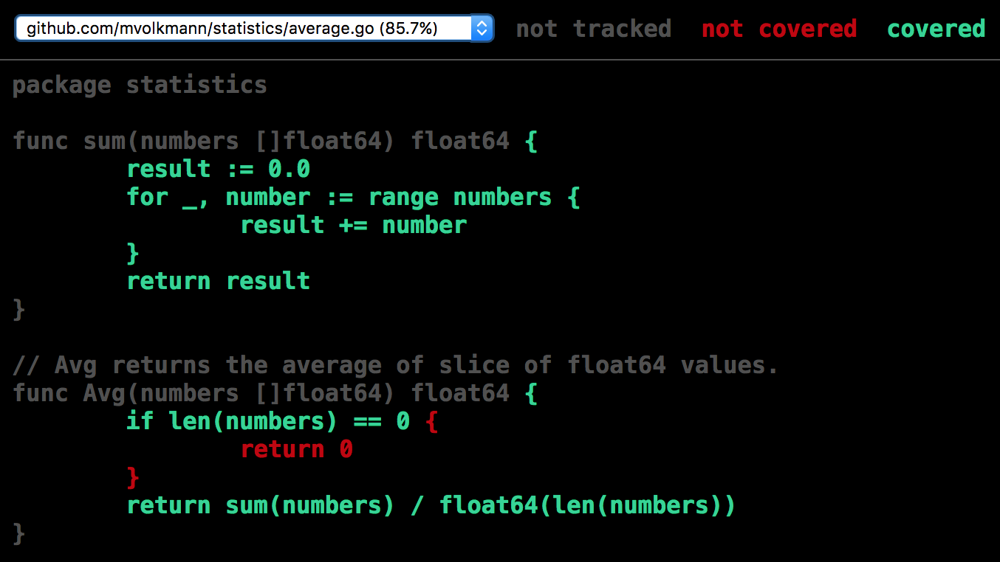
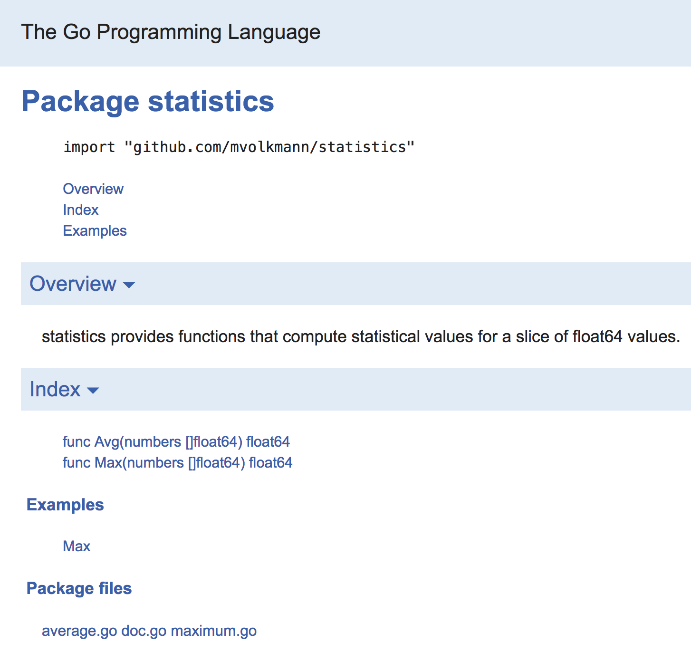
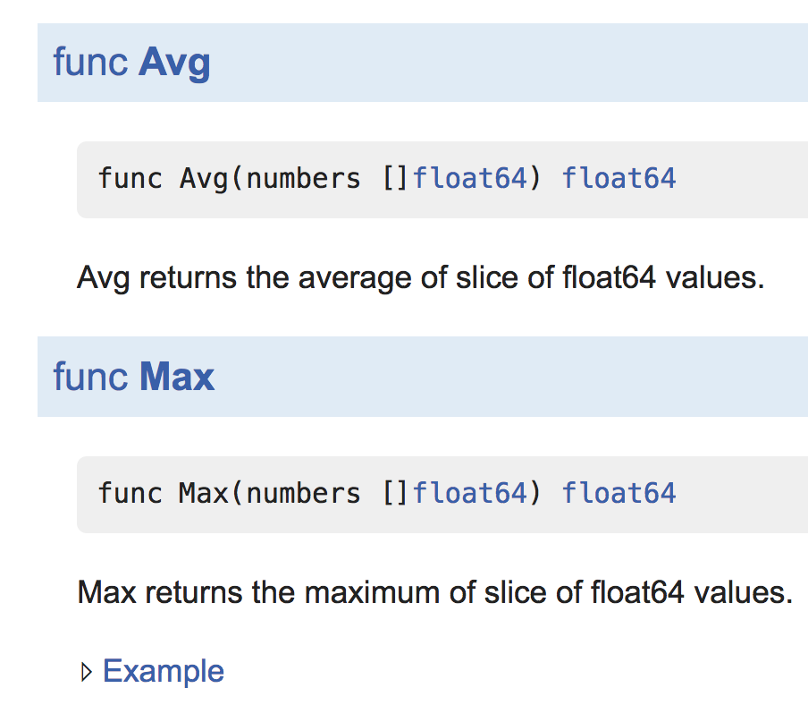
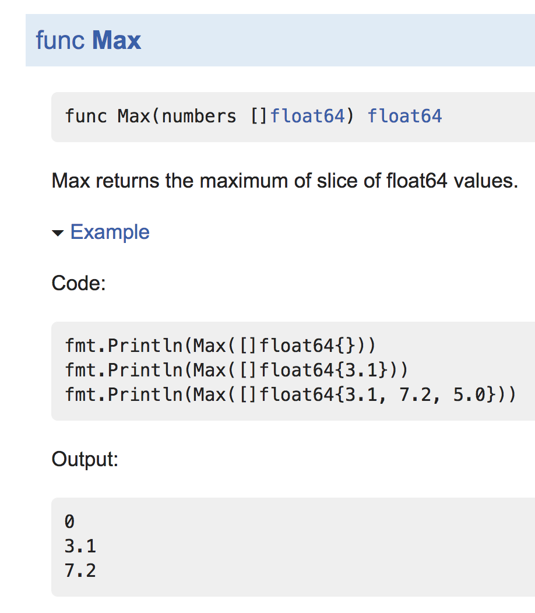

# Go Programming Language Notes

## Overview

Go was conceived by Robert Griesemer, Rob Pike, and Ken Thompson,
all working at Google, starting in September 2007.
About a year later Russ Cox and Ian Taylor joined the team.

Go was officially announced in November 2009.
Go 1.0 was released in March 2012.
Currently (as of August 2018) the latest version is
Go 1.10 which was released in February 2016.
The third beta release of Go 1.11 was released in August 2018.

Many of Go's goals are in comparison to languages like C++ and Java.
Go aims to:

- address software issues at Google
- be simple, indicated by having a small specification
  and fewer features compared to other programming languages
- be safe in terms of memory utilization
- be readability
- enable faster software development
- enable faster build times
- have a less cumbersome type system that provides type inference
  and use composition instead of type hierarchies
- provide garbage collection
- support parallel computation, taking advantage of multi-core computers
- support concurrent execution and communication
- enable easier dependency analysis
- make it easier to write tools that analyze and process the code

Because simplicity and performance are major goals,
many features found in other programming languages
are not present in Go. These include classes (and inheritance),
annotations, exceptions, the ternary operator, and generic types.
The lack of support for generic types means that there can be no
generic `map`, `filter`, and `reduce` functions for collections.
It is possible that generic types may be added in a future version
and that is an area of active debate.

Go is compiled to platform-specific machine code,
not bytecode for a virtual machine
that must be interpreted at runtime.

While Go can be used as a systems programming language,
currently most developers use C, C++, or Rust for that.

Go does not compete with scripting languages like
JavaScript, Perl, Python, and Ruby.

Currently the most common uses for Go are dev ops tooling
and server side web application development.

The primary Go compiler and runtime are implemented in Go and assembler.

## Go Lineage

Many previous programming languages inspired the design of Go.


## Characteristics

Go's characteristics at a glance include:

- compiled to native binaries and libraries
- statically typed
- high performance
- provides type inference
- performs garbage collection
- supports concurrency with lightweight "threads" via goroutines
- provides communication between goroutines using channels
- supports networking operations
- minimal support for object-oriented programming
  through structs with methods

## Reasons to use Go

Some of the primary reasons developers choose to use Go include:

- Go is a relatively small language that is easy to learn
  (the May 9, 2018 spec. is only 78 pages).
- Go provides good type safety.
- Go provides excellent support for asynchronous programming
  with goroutines and channels.
- The Go standard library supports writing networking applications.
- The Go compiler is fast.
- Go generates native executables, not code that requires a virtual machine.
- Executables produced by Go have good performance.
- Go does not support pointer arithmetic and that contributes to simpler code.

## Reasons to use C/C++/Rust instead of Go

Some of the primary reasons developers choose not to use Go include:

- TODO: Is Rust mature enough to be considered along side C and C++?
- Go does not yet have a mature solution to manage
  package dependency versions for a project.
- Go does not support generic types which precludes
  some aspects of functional programming.
- Some developers feel that the C and C++ libraries are
  currently more mature than Go libraries.
- Currently it is easier to find developers that have C and C++ experience
  than finding Go developers.
- Go provides garbage collection and does not allow control of
  memory allocation/deallocation that is needed for real-time guarantees.
- Go does not support pointer arithmetic.
- Some developers object to community standards for Go
  like using gofmt to format code.

## Zero to Hero

Let's walk through the steps to create a Go application.
If you don't already have a GitHub (<https://github.com>)
or Bitbucket (<https://bitbucket.org>) account,
I recommend creating one now so you can experience publishing an app.

This article uses the term "terminal" to refer to
a Windows Command Prompt or a Linux/Mac Terminal window.

### Install Go

One way to install Go is to browse <https://golang.org/dl/>,
download a platform-specific installer, and double-click it.
If you are using a Mac and have Homebrew (<https://brew.sh/>) installed,
you can instead just run `brew install go`.
To verify that this worked, open a terminal and enter `go version`
which should output the version of Go you have installed.

### Create Workspace

Go projects live in a workspace
which is home to one or more packages.
A package is defined by one or more `.go` source files
that reside in the same directory within a workspace.

You can have a separate workspace for each project
or one workspace that contains all your projects.
Either way the environment variable `GOPATH` must be set to point
to the top directory of the workspace you are currently using.

Create a `go` directory in your home directory.
Set `GOPATH` to point to this directory.
In the future if you decide to
create an additional workspace and switch to it,
don't forget to change this environment variable to point to it.

One way to see the current value of `GOPATH` is to enter `go env GOPATH`.
This works on any platform, unlike entering `echo $GOPATH`
which only works on UNIX-like systems.

### Create First App

Create a `src` directory inside your `go` directory.

When a Go package or application is installed in a workspace it is
placed in a directory that corresponds to the URL where it is published.
That URL, minus the leading `https://` is used to install the package.
For example, if you enter `go get github.com/julienschmidt/httprouter`
it will download the package and place its `.go` files in the
`$GOPATH/src/github.com/julienschmidt/httprouter` directory.
It will also build the package and place its object file,
`httprouter.a` in the
`$GOPATH/pkg/{platform}/github.com/julienschmidt` directory.

It is recommended that you use the same approach for placing
your own packages in a workspace to avoid naming collisions and
leave you ready for publishing the code in the future.

Note that there can be many local version control repositories
under the `src` directory.

Determine your preferred repository domain, such as `github.com`
and make sure you know your repository username, such as `mvolkmann`.
Create the directory `{repo-domain}/{repo-username}/{name}`
inside your `src` directory where `name` is the name
of an application or package name you wish to create.
For me this would be `github.com/mvolkmann/hello`.

Create the file `main.go` inside this directory.

Go source files begin with a `package` statement.
That is followed by imports of other packages if any are needed.
The imports are followed by top-level declarations of
package-scoped constants, variables, types, methods, and functions.
Each of these will be described in detail later.

Each application has a single function named `main`
that must be in a package named `main`.
The one file that defines the `main` function
is often named `main.go`, but that is not required.

The primary way of writing output to the standard output stream (stdout)
is to use functions in the `fmt` package.

All Go applications must have one file when a package of `main`
that defines a `main` function that is its starting point.

Add the following to `main.go`.

```go
package main

import "fmt"

func main() {
  fmt.Println("Hello, World!")
}
```

As you experiment with various features of Go,
you'll likely want to create additional directories
like `hello` that each contain a `main.go` file.

### Run First App

Open a terminal and cd to your application directory.
Enter `go run main.go` to run the app.
Consider creating an alias for this, perhaps `grm`,
because you'll be running this command often.
This should output "Hello, World!".

### Build First App

To build an executable for this app, enter `go build` while in
the directory containing the file that defines the `main` function.
This will create an executable file in the current directory
that has the same name as the directory, `hello` in this case.
In Windows this file will have a `.exe` file extension.

To run this app, enter `./hello`, or just `hello` in Windows.

Go executables are statically linked which means
that can be run without any other supporting files.
They can be copied to a machine with the same architecture
and be run without installing anything related to Go.

### Install First App

When Go installs an app it creates the executable
in the `bin` subdirectory of the current workspace.
If this directory doesn't exist, it is created.
It is convenient to have this directory listed
in your `PATH` environment variable so that these executables
can be run from anywhere by just entering their names.
Go ahead and add `$HOME/go/bin` to your `PATH` environment variable now.
In Windows, use ??? in place of `$HOME`.

To install the app, enter `go install` while in
the directory containing the file that defines the `main` function.
This will create an executable file in the `$GOPATH/bin` directory.
Assuming that your `PATH` environment variable is set correctly
you can now run the app by just entering `hello`
regardless of your current working directory.

To delete the installed executable,
enter `go clean -i`.

### Create First Package

Non-trivial Go applications divide their code into several packages.
A package is a collection of `.go` files in the same directory
that all begin with the same `package` statement.
By convention, the directory name of a package should match the package name.
We will cover packages in more detail later.

To keep things simple so we can focus on the mechanics of Go we will
create a package that just provides a couple of basic functions.
The first will return the largest number in a set of numbers.
The second will return the average of a set of numbers.

Create the directory `$GOPATH/src/github.com/mvolkmann/statistics`,
substituting your repo domain and username.
Create the files `max.go` and `average.go` in this directory.
We could define both functions in the same file, but we are using
two files to show that a package can be defined by multiple source files.
Note that both files must begin with the same `package` statement.

The code below contains several comments to explain certain Go features.
These will be described in more detail later.

Add the following to `maximum.go`.

```go
package statistics

// Max returns the maximum of "slice" of float64 values.
// For now think of a slice as being like an array.
// Functions are only available to be used in other packages
// if they are "exported" which is indicated by
// starting their names with an uppercase letter.
// The type of the parameter "numbers" is a "slice"
// of double-precision floating point numbers.
// For now think of a slice as being like an array.
// The return type follows the parameter list.
func Max(numbers []float64) float64 {
  if len(numbers) == 0 {
    return 0
  }

  // The := operator declares the variable on the left
  // and initializes it to the value on the right.
  max := numbers[0]

  // "range" is a keyword that is used to iterate over many kinds of sequences,
  // one of which is a slice.  In each iteration it returns two values.
  // For slices it returns an index and the value at that index.
  // In this example we do not need the index.
  // That is indicated by placing it in the special underscore variable.
  for _, number := range numbers {
    if number > max {
      max = number
    }
  }

  return max
}
```

Add the following to `average.go`.

```go
package statistics

// This function is for internal use by this package
// so it is not exported (name starts lowercase).
func sum(numbers []float64) float64 {
  result := 0.0
  for _, number := range numbers {
    result += number
  }
  return result
}

// Avg returns the average of slice of float64 values.
func Avg(numbers []float64) float64 {
  if len(numbers) == 0 {
    return 0
  }
  // Go is very picky about types!
  // The "len" function returns an int.
  // We cannot divide a float64 by an int,
  // so we must cast the int to float64.
  return sum(numbers) / float64(len(numbers))
}
```

Running `go install` from the `statistics` package directory
creates is a `statistics.a` file in the directory
`$GOPATH/pkg/{platform}/github.com/mvolkmann` directory.
If any of these directories below `$GOPATH` do not yet exist,
they will be created.
The file `statistics.a` is an object file.
When other packages that use this package are installed,
this file is used rather than compiling the code again
to speed up build times.

### Add Tests

The Go standard library provides a
lightweight testing package called `testing`.
Let's add tests to the "statistics" package.
The VS Code Go extension provides the "Go: Generate Unit Tests For Package"
command that does what its name implies.
It generates files with names that end in `_test.go`
for each `.go` file in the current package.
You could of course manually create these files.
Here is what it generates in `maximum_test.go` for our `maximum.go` file.

```go
package statistics

import "testing"

func TestMax(t *testing.T) {
  type args struct {
    numbers []float64
  }
  tests := []struct {
    name string
    args args
    want float64
  }{
    //TODO: Add some test data here.
  }
  for _, tt := range tests {
    t.Run(tt.name, func(t *testing.T) {
      if got := Max(tt.args.numbers); got != tt.want {
        t.Errorf("Max() = %v, want %v", got, tt.want)
      }
    })
  }
}
```

This uses the `testing` package from the Go standard library.
Each test function must have a name that begins with `Test`
and take a pointer to a `testing.T` object.
These functions create a slice of structs called `tests`
that each describe an individual test assertion.
Each test assertion has a name, a set of arguments to be passed
to the function being tested (called "args"),
and the expected result (called "want").
The loop that follows iterates through the "tests"
and fails if the actual value returned from the
function being tested does not match the "want" value.

All that is left for us to do is replace the `TODO` comment
with some test data.
Replace the `TODO` comment with the following:

```go
    {"empty slice", args{[]float64{}}, 0.0},
    {"single value", args{[]float64{3.1}}, 3.1},
    {"multiple values", args{[]float64{3.1, 7.2, 5.0}}, 7.2},
```

The tests for `average.go` in `average_test.go` are a little tricker.
When comparing computed floating point values,
we need to test whether they are "close", not exact, due to the
well-known issue of representing floating point numbers in binary.

We can add import the "math" package in the test file
and add a function like this:

```go
func close(n1 float64, n2 float64) bool {
  return math.Abs(n1-n2) < 1e-9
}
```

Then we can change `got != tt.want` in the tests to
`!close(got, tt.want)`.

The `average_test` file ends up as follows:

```go
package statistics

import (
  "math"
  "testing"
)

func close(n1 float64, n2 float64) bool {
  return math.Abs(n1-n2) < 1e-9
}

func Test_sum(t *testing.T) {
  type args struct {
    numbers []float64
  }
  tests := []struct {
    name string
    args args
    want float64
  }{
    {"empty slice", args{[]float64{}}, 0.0},
    {"single value", args{[]float64{3.1}}, 3.1},
    {"multiple values", args{[]float64{3.1, 7.2, 5.0}}, 15.3},
  }
  for _, tt := range tests {
    t.Run(tt.name, func(t *testing.T) {
      if got := sum(tt.args.numbers); !close(got, tt.want) {
        t.Errorf("sum() = %v, want %v", got, tt.want)
      }
    })
  }
}

func TestAvg(t *testing.T) {
  type args struct {
    numbers []float64
  }
  tests := []struct {
    name string
    args args
    want float64
  }{
    {"empty slice", args{[]float64{}}, 0.0},
    {"single value", args{[]float64{3.1}}, 3.1},
    {"multiple values", args{[]float64{3.1, 7.2, 5.0}}, 5.1},
  }
  for _, tt := range tests {
    t.Run(tt.name, func(t *testing.T) {
      if got := Avg(tt.args.numbers); !close(got, tt.want) {
        t.Errorf("Avg() = %v, want %v", got, tt.want)
      }
    })
  }
}
```

Note that this includes tests for both exported and non-exported functions.

To run the tests, cd to the `statistics` directory and enter `go test`.
Try changing an assertion so it fails
and run the tests again to see failing output.
This includes the test function name, file name,
assertion name, and line number of each failure.

If the tests in a file require
setup before any of its test functions run
or teardown after all of its test functions run,
define a `TestMain` function. For example,

```go
func TestMain(m *testing.M) {
  // Do setup here.

  // Run all the test functions in this file.
  result := m.Run()

  // Do teardown here.

  // This MUST be done to complete the tests in this file!
  os.Exit(result)
}
```

To run tests for multiple packages,
cd to `$GOPATH` and enter `go test` followed by
the import paths of all the packages to be tested.
Wildcards in these import paths are not supported.

When `go test` is given package paths to run,
it remembers (caches) successful tests.
Later when a package is tested again in this way, if its last
test was successful and there have been no related code changes
the tests run are not run again in order to save time.
When this happens "(cached)" will appear after the test
in place of the elapsed time.
Note that tests never skipped in this way when
`go test` is run with no package names
inside the package directory.

### Test Coverage

Go has builtin test coverage.
To merely see the percentage of code in the current package
that is covered by tests, enter `go test -cover`.
To capture test coverage details in file,
enter `go test -coverprofile=cover.out`.
To open an HTML presentation of this data in the default browser,
enter `go tool cover -html=cover.out`.
For example, here is a screenshot of the result if we
comment out the assertion for an empty slice in the `TestAvg` function.



The dropdown menu in the upper left can be used to
view coverage for a different source file.
It shows the percentage of coverage for each file.

### Example Tests

The test tool also supports a form of tests called "examples".
These tests write to stdout and provide a special comment
that describes the expected output.
The test fails if the expected output is not produced.
These test function names must begin with `Example`.

Here is an example of such a test for our `Maximum` function that can be
added to `$GOPATH/src/github.com/mvolkmann/statistics/maximum_test.go`.

```go

```

Note that test coverage for example tests is not currently tracked accurately.
For example, failing to test the empty slice case of the `Max` function
reports that none of the code in the `Max` function is covered.

While example tests are a kind of test,
their main purpose is to provide example code for using a package
in generated documentation, which is covered next.

Another form of tests not covered here is benchmark tests.

For more detail on Go tests, see <https://golang.org/pkg/testing/>.

### Generate Documentation

The `go doc` and `godoc` tools generates package documentation.
They parse `.go` source files, looking for
comments that follow certain conventions.

To add documentation to any package-level declaration
(package, type, constant, variable, function, or method)
add a comment directly before it.
Godoc will render the comment to the right of the item to which it pertains.

Paragraphs must be separated by blank line.

When HTML documentation is generated, URLs in documentation comments
converted to hyperlinks.

Text to be output in a monospace font, such as code examples,
should be indented farther than the other comment text.

The comment preceding a package statement can appear in any source file
for the package. If the package has more than one source file,
this comment does not need to be repeated in each of them.
One approach for multi-file packages is to create a file named `doc.go`
that only contains the comment followed by a `package` statement.
Package comments should begin with the name of the package,
followed by a description of its purpose.

Create the file `doc.go` in the `statistics` directory
with the following content:

```go
// statistics provides functions that compute statistical values
// for a slice of float64 values.
package statistics
```

We already have good comments above the exported functions
in `average.go` and `maximum.go`.

The `go doc` command provides a quick overview of a package.
For an overview of our `statistics` package,
enter `go doc` in the `statistics` directory
or `go doc statistics` if in another directory.
This produces the following output:

```text
package statistics // import "github.com/mvolkmann/statistics"

statistics provides functions that compute statistical values for a slice of
float64 values.

func Avg(numbers []float64) float64
func Max(numbers []float64) float64
```

Note this tells us how to import the package and the
purpose of the package, but does not output the function comments.

The `godoc` command produces more detailed documentation.
Enter `godoc` followed by a package path.
This can also be used to view documentation on standard library packages.
In addition to specifying a package name, a name the package exports
can be specified to limit the output to just that documentation.
For example, `godoc strings Join`.

To see documentation for our "statistics" package,
enter `godoc github.com/mvolkmann/statistics`
which produces the following output:

```text
PACKAGE DOCUMENTATION

package statistics
    import "github.com/mvolkmann/statistics"

    statistics provides functions that compute statistical values for a
    slice of float64 values.

FUNCTIONS

func Avg(numbers []float64) float64
    Avg returns the average of slice of float64 values.

func Max(numbers []float64) float64
    Max returns the maximum of slice of float64 values.
```

To browse an HTML version of this documentation,
enter `godoc -http=:1234` where 1234 is a port.
Any available, non-privileged port can be used.
Browse localhost:1234 to see a local version of all the official Go documentation
including documentation on your packages.
To see documentation for our `statistics` package,
press the "Packages" button at the top,
search the page for "statistics", and click that link.
The following will be displayed:




To see example code for the `Max` function and its output
expand the "Example" section at the bottom of its documentation.


### Use Package

Now we're ready to use our statistics package
in our application.
Edit `$GOPATH/src/github.com/mvolkmann/hello/main.go`.
Change the import statement to the following.

```go
import (
  "fmt"
  "github.com/mvolkmann/statistics"
)
```

Add the following to the `main` function.

```go
  numbers := []float64{1, 2, 7}
  fmt.Println("maximum =", statistics.Max(numbers))
  fmt.Println("average =", statistics.Avg(numbers))
```

Run the code by entering `go run main.go` from the `hello` directory
and verify that the correct output is produced.

### Community packages

Using community packages is similar to using our own custom packages.
They just need to be installed.

For example, to install the package "github.com/ttacon/chalk",
enter `go get github.com/ttacon/chalk`.
This package is similar to the Node package "chalk"
which outputs ANSI escape sequences to color and style text
that is written to the terminal.
Installing this will add the source files for the package
in the appropriate directory below `$GOPATH/src` and
install it by building a `.a` object file under `$GOPATH/pkg`.

To use this package in our app, edit `main.go`,
add an import for this package,
and add the following in the `main` function.

```go
  fmt.Printf("%s%s%s\n", chalk.Magenta, "So pretty!", chalk.Reset)

  red := chalk.Red.Color
  yellow := chalk.Yellow.Color
  blue := chalk.Blue.Color
  fmt.Println(red("Hello,"), yellow("my name is"), blue("Mark!"), chalk.Reset)
}
```

### Publish Package or App to GitHub

TODO: Add this section?

## Important Environment Variables

- `GOARCH`\
  Set this to the target architecture to use when compiling. When not set, the current architecture is assumed.
- `GOBIN`\
  Set this to the directory where packages should be installed.
  TODO: What happens when this is not set?
- `GOOS`\
  Set this to the target operating system to be targeted by the Go compiler.
  When not set, the current operating system is assumed.
- `GOPATH`\
  Set this to the current workspace directory
  which is where source files are located.
  Change this when switching workspaces.
- `GOROOT`\
  Set this to the directory where Go tools are installed.
  TODO: What happens when this is not set?

## Companies Using Go

A long list of companies currently using Go is maintained at
<https://github.com/golang/go/wiki/GoUsers>. The list includes:

Adobe, AgileBits (1Password), BBC, Bitbucket, CircleCI, CloudFlare,
Cloud Foundry, Comcast, Dell, DigitalOcean, Docker, Dropbox, eBay,
Facebook, General Electric, GitHub, GitLab, Google, Heroku, Honeywell,
IBM, Intel, Lyft, Medium, Mesosphere, MongoDB, Mozilla, Netflix,
New York Times, Oracle, Pinterest, Pivotal, Rackspace, Reddit,
Riot Games, Shutterfly, Slack, Square, Stripe, Tumblr, Twitch, Twitter,
Uber, VMware, Yahoo

## Implemented in Go

The following applications and libraries are some of
the more popular ones that have been implemented in Go.

- Docker - assembles container-based systems
  (open source version is now called "Moby")
- Kubernetes - production-grade container scheduling and management
  <http://kubernetes.io>
- Revel - full-stack web framework <https://github.com/revel/revel>
- InfluxDB - scalable datastore for metrics, events, and real-time analytics
  <https://github.com/influxdata/influxdb>
- TODO: Find more!

## Alternative Go Implementations

Besides the primary Go implementation at <https://golang.org/>,
there are several alternative implementations.
These include:

- gccgo <https://gcc.gnu.org/onlinedocs/gccgo/>\
  GNU compiler for Go
- GopherJS <https://github.com/gopherjs/gopherjs>\
  This compiles Go to JavaScript.
- llgo <https://github.com/go-llvm/llgo>\
  LLVM-based compiler for Go
- WASM (Web Assembly)\
  Early support is available now,
  but it is not yet ready for serious use.
  See <https://react-etc.net/entry/webassembly-support-lands-in-go-language-golang-wasm-js>
- mgo?\
  TODO: I can't find this, but heard it mentioned on "Go Time" podcast.
  Is it for small processors like Arduino?

## Syntax Highlights

This section presents some ways that Go syntax differs
from the syntax of other programming languages.

A Go source file contains a package clause,
followed by zero or more import declarations,
followed by zero or more package-level declarations.

A package-level declaration is a declaration of a package
constant, variable, type, function, or method.
All of these begin with a keyword which is one of
`const`, `var`, `type`, or `func`.
These declarations can appear in any order.
Only these can appear outside of functions.
This precludes use of the `:=` operator and
non-declaration statements, like `if` and `for`,
outside of functions.

Package-level names that start uppercase are "exported".
This means that other packages that import their package
can access them.

Types follow variables and parameters, separated by a space.
For example, `var score int8`.

Semicolons are not required, but can be used
to place multiple statements on the same line.

In some languages `string[]` is an array of strings.
In a GraphQL schema, this would be written as `[string]`.
But Go chooses a third option, `[]string`
which was inspired by Algol 68.

## Package Initialization

Initialization of package-level variables that require logic,
not just literal values or results of function calls,
must be done in `init` functions.
A package can have any number of `init` functions
in any of its source files.
These functions are run in the order they appear,
and alphabetically by source file name within a package.

The `init` functions of all imported packages
are run before those of a given package.
All `init` functions of all imported packages are run
before the `main` function of an application is run.

## Tooling

The `go` command has many sub-commands.
The most commonly used sub-commands are summarized below.

- `go help [command|topic]`\
  This outputs help.
  Run this with no arguments to see a list of commands and topics.
- `go doc {package} [function|type]`\
  This outputs brief documentation for a given package, constant, function, or type.
  For example, `go doc json` where `json` is a standard library package.
- `godoc {pkg}`\
  This is a different command that outputs even more documentation.
  Add `-src` to see source code for a package.
  To get documentation on a single member of a package,
  add a space and the name after the package name.
  For example, `godoc math/Rand Int31`
- `go fix {file-or-directory-path}`\
  This "finds Go programs that use old APIs and rewrites them to use newer ones."
  "After you update to a new Go release,
  fix helps make the necessary changes to your programs."
- `go get {pkg1} {pkg2} ...`\
  This downloads and installs packages and their dependencies.
- `go build`\
  This builds an executable for the package in the current directory
  that includes everything needed to run
  and places it in the current directory.
  The executable can be moved anywhere.
  Go tools do not need to be installed in order to execute the result.
- `go install {pkg-name}`\
  This builds a given package and installs it in `GOBIN` which must be set.
  It also builds all the dependencies of the package,
  and recursively all of their dependencies.
  If run from the package directory, the package name can be omitted.
- `go clean -i {pkg-name}`\
  This deletes the executable for the package from `GOBIN`.
  If run from the package directory, the package name can be omitted.
- `go run {file-name}.go`\
  This runs a program without producing an executable.
- `go test`\
  This runs all the tests in the current package.
  To run tests in multiple packages,
  cd to the `GOPATH` directory and
  specify a space-separated list of package import paths.
- `go generate`\
  This creates or updates Go source files.
  TODO: Learn more about this!
- `go version`\
  This outputs the version of Go that is installed.
  To get the version in code, call `runtime.Version()`.
- `go vet`\
  This "examines Go source code and reports suspicious constructs,
  such as Printf calls whose arguments do not align with the format string.
  It "uses heuristics that do not guarantee all reports are genuine problems,
  but it can find errors not caught by the compilers."

Many sub-commands support the `-race` flag which
adds detection and reporting of data races.
These include `test`, `run`, `build`, and `install`.

There are many Go tools that are not sub-commands of the `go` command.
Some of the more popular ones include:

- `golint`\
  This is a linter for `.go` files that just focuses on coding style.
  Unlike `gofmt` which corrects some issues, `golint` just reports them.
- `gometalinter`\
  This concurrently runs many other Go tools
  and collects and reports their output.
  For a list of support tools, see
  <https://github.com/alecthomas/gometalinter#supported-linters>.
  `golint` is one of the supported tools.
- `gofmt`\
  This formats code in the standard format.
  It uses tabs for indentation and spaces for alignment.
  It also alphabetizes imports.
- `goimports`\
  This does what `gofmt` does and also
  adds missing imports and removes unused imports.
  In addition, it reorders the imports into two groups,
  standard library packages and all other packages.
- `goreturns`\
  This is based on `goimports`.
  In addition to that functionality
  it adds missing values to `return` statements using
  the zero-values of the corresponding declared return types.

## Editor Support

Many editors and IDEs have support for Go,
often through plugins or extensions.
For example,

- Atom has the Go-Plus package.
- Eclipse has the GoClipse plugin.
- Emacs has many Go plugins (TODO: Is this what emacs calls them?)
  that include go-mode.el, go-playground, and GoFlyMake
- GoLand from JetBrains is standalone editor and a plugin for IDEA.
- Sublime Text has the GoSublime plugin and Golang Build.
- Vim has the vim-go plugin.
  This is a popular options in the Go community.
- VS Code has the Go extension from Microsoft.
  This is another popular option in the Go community.

## VS Code Go Extension

The VS Code Go extension from Microsoft is very popular in the Go community.

It provides auto complete of local and imported functions.
Hover over the name of a constant, variable, type, or function
to see information about it in a popup.

To jump to the definition of a name, ctrl-click (cmd-click) it.
This even works with names defined in standard library packages.

After typing the opening `(` of a function call
a popup describing the expected arguments appears.
Argument values with an invalid types are described in the PROBLEMS tab.

User-defined snippets specific to `.go` files are supported,
but none are predefined. To add them,
select Code...Preferences...User Snippets...Go.
For example, you could add these:

```json
{
  "function": {
    "prefix": "fn",
    "body": [
      "func ${1:name}(${2:parameters}) ${3:return-type} {",
      "  ${4:body}",
      "}"
    ]
  },
  "main package/function": {
    "prefix": "main",
    "body": ["package main", "", "func main() {", "  ${1:body}", "}"]
  },
  "print format": {
    "prefix": "pf",
    "body": "fmt.Printf(\"${1:format-string}\\n\", ${2:expressions})"
  },
  "print line": {
    "prefix": "pl",
    "body": "fmt.Println(\"$1\")"
  },
  "print variable": {
    "prefix": "pv",
    "body": "fmt.Printf(\"${1} = %+v\\n\", ${1})"
  }
}
```

By default, several Go tools are run when changes to `.go` files are saved.
These include `golint`, `govet`, and `goreturns`, all described earlier.

The default value of the "go.formatTool" user setting is `goreturns`.
This can be changed to `goimports` or `gofmt`.

To find all the references to a given function,
right-click its name and select "Find All References".

When viewing a test file, individual test functions can be run by
clicking on the "run test" link that appears above every test function

VS Code will attempt to infer the correct value for `GOPATH`
if the user setting `"go.inferGopath": true,` is added.
"It searches upwards in the path for the src directory,
and sets GOPATH to one level above that."

Many commands starting with "Go:" are added to the Command Palette.
These include:

- "Add Import"\
  This displays a list of standard library packages.
  Select one to add an import for it.
- "Browse Packages"\
  This displays a drop-down list of standard library packages
  Select one to see a list of files in the package.
  Select a file to view the source code.;
- "Current GOPATH"\
  This shows current GOPATH in a popup in lower right.
- "Generate Interface Stubs"\
  This is supposed to generate method stubs for
  all the methods in a given interface for a given receiver type,
  but I haven't been able to get it to work.
- "Generate Unit Tests for File"\
  This generates a `_test.go` file for the current file
  that provides a good starting point for implementing tests.
- "Run on Go Playground"\
  This loads current file into the web-based Go Playground
  where it can be run by pressing the "Run" button
- "Test Function At Cursor"\
  This runs only the test function under the cursor.
  The cursor must be over a test function, not the function to be tested.
- "Test File"\
  This runs all tests for the current file
- "Test Package"\
  This runs all tests for the current package
- "Test All Packages in Workspace"\
  This runs all tests under the `src` directory,
  including tests for all installed packages.

## Standard Library Packages

Go provides many packages in the "standard library".
To see a list of them, browse <https://golang.org/pkg/>.
Highlights include:

- bufio\
  This implements buffered I/O with `Reader` and `Writer` types.
- builtin\
  This not a real package, just a place to document
  builtin constants, variables, types, and functions.
- container.list\
  This implements doubly linked lists.
- database/sql\
  This defines interfaces implemented by relational database-specific drivers.
  For example, there are drivers for MySQL and PostgreSQL.
- encoding\
  This defines interfaces for reading and writing
  various data formats such as csv, json, and xml.
- errors\
  This defines the `New` function for creating `error` structs with a string
  description and a method to get those strings from an `error` struct.
- flag\
  This implements command-line flag parsing.
- fmt\
  This implements formatted I/O similar to C's `printf` and `scanf`.
- go\
  The sub-packages implement all the standard go tooling
  such as source file parsing to ASTs and code formatting.
- html\
  This implements functions to parse and create HTML.
- image\
  This implements functions to parse (decode) and create (encode) images.
- io\
  This implements functions to read and write buffers and files.
- log\
  This implements simple logging.
- math\
  This implements many math functions.
- mime\
  This encodes and decodes multimedia formats.
- net\
  This implements network I/O including TCP and UDP.
- net/http\
  This implements functions to send and listen for HTTP and HTTPS requests.
- os\
  This provides access to operating system functionality
  like that provided by UNIX shell commands.
  It exposes the constants `PathSeparator` ('/' on UNIX)
  and `PathListSeparator` (':' on UNIX).
- os/exec\
  This runs external (operating system) commands.
- path\
  This implements functions for working with UNIX-style file paths and URLs.
- reflect\
  This implements reflection to work with types determined at run-time.
- sort\
  This implements functions for sorting slices and other collections.
- strconv\
  This implements conversions to and from
  string representations of primitive types.
- strings\
  This implements many functions on strings including
  `Contains`, `HasPrefix`, `HasSuffix`, `Index`, `Join`,
  `Repeat`, `Split`, `ToLower`, `ToTitle`, `ToUpper`, and `Trim`
  It also defines the `Builder`, `Reader`, and `Replacer` types.
- sync\
  This provides synchronization primitives such as mutual exclusion locks.
  Often code will use channels and `select` instead.
- testing\
  This supports automated tests run by `go test`.
  The `quick` sub-package implements fuzz testing.
- text\
  This provides functions for parsing text,
  writing tabbed columns, and data-driven templates.
- time\
  This provides functions to measure and display time and dates.
- unicode\
  This provides functions for working with Unicode characters.

In addition to the standard library, also see "sub-repositories" that are
part of the Go project, but maintained outside the main repository.

## fmt Standard Library

The `fmt` standard library defines many functions
for reading and writing formatted messages.

Functions that read have names that start with `Scan`.
Functions that write have names that start with `Print`.

The most commonly used functions in this package include:

- `fmt.Errorf(format string, args ...interface{}) error`\
   This creates an error object containing a formatted message.

- `fmt.Printf(format string, args ...interface{})`\
  This writes a formatted string to stdout.

- `fmt.Println(args ...interface{})`\
  This writes the string representation of each of the arguments
  to stdout, followed by a newline.

- TODO: ADD MORE!:

## Community Packages

To see a list of community contributed packages
with links to documentation, browse one of these:

- <https://godoc.org/>
- <https://go-search.org/>
- <https://github.com/golang/go/wiki/Projects>

## Names

- Go requires some variable, function, and struct field names to be all uppercase
- includes ID, JSON, and URL

## Comments

- same a C
- `/* ... */` for multi-line comments
  - primarily used for the comment at the top of a package
    and to temporarily comment out sections of code
- `//` for single-line comments
  - used for all other kinds of comments,
    even those above functions

## Zero Values

Every type as a "zero value" which is the value it takes on when it is not initialized.

| Type            | Zero Value                                                      |
| --------------- | --------------------------------------------------------------- |
| bool            | false                                                           |
| number          | 0                                                               |
| rune            | 0                                                               |
| string          | ""                                                              |
| array           | array of proper length where all elements have their zero value |
| slice           | empty slice with length 0 and capacity 0                        |
| map             | empty map                                                       |
| struct          | struct where all fields have their zero value                   |
| all other types | nil                                                             |

## Variables

Variables in Go have the following characteristics:

- mutable unless defined with `const`
- block-scoped within functions, so those in
  inner scopes can shadow those in outer scopes
- names must start with a letter and
  can contain letters, digits, and underscores
- local to their package unless name starts uppercase

Go distinguishes between declaring, initializing, and assigning variables.

Variables that are declared outside of functions have package scope
which means they are accessible by all files in the package,
but not outside the package.
However, giving them a name that starts uppercase makes them
accessible anywhere the package is imported.

Variables outside of functions must be declared with a `var` statement.
This accepts a type and/or initial value. Examples include:

```go
var name string // defaults to zero value for the type
var name = "Mark"
var name string = "Mark"
```

While both a type and initial value can be provided,
that is redundant since the type can be inferred from the value
and some editor plugins/extensions will warn about this.

Multiple variables can be declared with one `var` statement.

```go
var name, age = "Mark", 57 // must initialize all
var (
  name string = "Mark"
  age number // not initializes, so will use zero value
)
```

When multiple consecutive variables have the same type,
the type can be omitted from all but the last.
For example, these are equivalent:

```go
var n1 string, n2 string, a1 int8, a2 int8, a3 int8
var n1, n2 string, a1, a2, a3 int8
```

Variables that are declared inside a function are local to that function.
There are two ways to declare variables inside a function.
One is to use a `var` statement just like when outside a function.
Another is to use the `:=` shorthand operator which does not allow a
type to be specified and instead infers it from the value on the right.
For example, `name := "Mark"`.

Multiple variables can be declared with one `:=` operator.
For example, `name, age := "Mark", 57`.

It is an error to attempt to declare a variable that has already been declared,
whether is with a `var` statement or using the `:=` operator.

Variables that have already been declared can be assigned new values
with the `=` operator. For example, `name = "Tami"`.
Multiple variables can be assigned with one `=` operator.
For example, `name, age = "Tami", 56`.

It is an error to attempt to assign to a variable that has not been defined.

The `:=` operator is particularly useful for capturing function return values.

There is an exception to the rule that existing variables cannot be re-declared.
As long as at least one variable on the left of `:=` has not yet been declared,
the other variables can already exist.
A common use case is when the variable `err` is used
to capture possible errors from a function call.

Functions can return an number of values.
Sometimes the caller is only interested in a subset of them.
The variable "\_" can be used to discard a specific return value.

## Constants

Go constants are defined using the `const` keyword.
They must be initialized to a primitive literal or an expression
that can be computed at compile-time and results in a primitive value.
For example, `const HOT = 100`.

## Operators

- arithmetic: `+`, `-`, `\*`, `/`, `%` (mod)
- arithmetic assignment: `+=`, `-=`, `\*=`, `/=`, `%=`
- increment: `++`
- decrement: `--`
- assignment: `=` (existing variable), `:=` (new variable)
- comparison: `==`, `!=`, `<`, `<=`, `>`, `>=`
  - arrays are compared by comparing their elements
  - structs are compared by comparing their fields
  - slices, maps, and functions cannot be compared
- logical: `&&` (and), `||` (or), `!` (not)
- bitwise: `&`, `|`, `^`, `&^` (bit clear)
- bitwise assignment: `&=`, `|=`, `^=`, `&^=`
- bit shift: `<<`, `>>`
- bit shift assignment: `<<=`, `>>=`
- channel direction: `<-`
- variadic parameter: `...paramName`
- slice spread: `sliceName...`
- pointer creation: `&varName`
- pointer dereference: `\*pointerName`
- block delimiters: `{ }`
- expression grouping: `( )`
- function calling: `fnName(args)`
- create array: `[elements]`
- struct member reference: `structName.memberName`
- statement separator: `;`
- array element separator: `,`
- define label: `someLabel:` (see `goto` keyword)

## Keywords

- `break` - breaks out of a `for` loop, `select`, or `switch`
- `case` - used in a `select` or `switch`
- `chan` - channel type
- `const` - declares a constant
- `continue` - advances to the next iteration of a for loop
- `default` - the default case in a `select` or `switch`
- `defer` - defers execution of a given function until the containing function exits
- `else` - part of an `if`
- `fallthrough` - used as last statement in a `case` to execute code in next `case`
- `for` - only loop syntax; C-style (init, condition, and post) or just condition
- `func` - defines a named or anonymous function
- `go` - precedes a function call to execute it asynchronously as a goroutine
- `goto` - jumps to a given label (see `:` operator)
- `if` - for conditional logic; also see `else`
- `import` - imports all the exports in given package(s)
  - see "Packages" section for more detail
- `interface` - defines a set of methods
  - defines a type where all implementing structs are compatible
  - structs do not state the interfaces they implement,
    they just implement all the methods
- `map` - type for a collection of key/value pairs where the keys and values can be any type
- `package` - specifies the package to which the current source file belongs
- `range` - used in a `for` loop to iterate over a
  string, array, slice, map, or receiving channel
- `return` - terminates the containing function and returns zero or more values
- `select` - chooses from a set of channel send or receive operations; see "Select" section
- `struct` -
- `switch` - similar to other languages; see "Switch" section
- `type` -
- `var` -

## Pointers

Pointers hold the address of a variable or `nil`.
Pointer types begin with an asterisk.
`*Type` is the type for a pointer to a value of type `Type`.

To get a pointer to a variable, `myPtr = &myVar`.
It is not possible to get the address of a constant.

To create a value and get a pointer to it in one line,
`myPtr := new(type)`.
Another way to do this which is preferred by many is
`var myThing type; myPtr := &myThing`.
The assembly code generated for these two approaches is identical.

To get the value at a pointer, `myValue = \*myPtr`.

To modify the value at a pointer, `\*myPtr = newValue`.

Pointer arithmetic, as seen in C and C++, is not supported in Go.

Suppose `person` is a struct containing a `name` field
and we have a pointer to that struct in the variable `ptr`.
To get the value of the name field, `var name1 = (*ptr).name`.
This can also be done with shorthand syntax that automatically
dereferences the pointer with `var name2 = ptr.name`.

## Output

- supported by the "fmt" package

```go
import "fmt"
fmt.Println(expression)
```

## If Statement

- parentheses are not needed around the condition being tested
- braces around body are required
- ex.

  ```go
  if x > 7 {
    ...
  } else {
    ...
  }
  ```

Almost any single statement can precede the condition,
separated from it by a semicolon.
However, typically an assignment statement is used.
The scope of the assigned variable is the if statement,
including the else block if present

```go
if y := x * 2; y < 10 {
  ...
}
```

## Switch Statement

Go's `switch` statement is similar to that in other languages,
but it can switch on expressions of any type.
Braces around body are required.
Case values can be literal values or expressions.
The `case` keyword can be followed by any number of
comma separated expressions. Matching any of them
causes the statements for that case to be executed.
Case blocks do not fall through by default
so `break` statements are not needed.
If it is desirable to fall through from one case to the next,
the `fallthrough` keyword enables this.

A basic `switch` statement looks like:

```go
switch name {
  case "Mark":
    // handle Mark
  case "Tami":
    // handle Tami
  case "Amanda", "Jeremy":
    // handle Amanda or Jeremy
  default:
    // handle all other names
}
```

A switch statement can include an initialization statement
just like an if statement. For example,

```go
switch name := buildName(person); name {
  case "Mark":
    // handle Mark
  case "Tami":
    // handle Tami
  default:
    // handle all other names
}
```

A `switch` statement with no expression executes the
first `case` block whose expression evaluates to true.
For example,

    ```go
    switch {
      case name == "Mark":
        // handle Mark
      case age < 20:
        // handle youngsters
      default:
        // handle all other cases
    }
    ```

To switch on the type of an expression,

```go
switch value := expression.(type) {
  case int, float:
    // handle int or float
  case string:
    // handle string
  default:
    // handle all other types
}
```

- the variable `value` will have the actual type
- `value :=` can be omitted if not needed
- expression can be an interface type and
  the actual type can be type that implements the interface

## For Statement

- the only looping statement
- braces around body are required
- can use `break` and `continue` inside
- syntax is `for init; cond; post { ... }`
  - no parentheses are allowed
  - note that the three parts are separated by semicolons
  - the "init" and "post" parts, if present, must be a single statement,
    but multiple variables can be assigned in a single statement
- ex.

  ```go
  for i := 0; i < 10; i++ {
    ...
  }
  ```

- init and post are optional

  - so a while loop in other languages looks like this in go

  ```go
  for ; i < 10; {
    ...
  }
  ```

  - or drop the semicolons because when only one part is present it is assumed to be the condition

  ```go
  for i < 10 {
    ...
  }
  ```

  - omit the condition for an endless loop

  ```go
  for {
    ...
  }
  ```

## Strings

- immutable sequences of bytes representing UTF-8 characters
- literal values are delimited with double quotes or back-ticks (to include newlines)
- to declare and initialize, `name := "Mark"`
- to retrieve a character, `char := name[index]`
- it iterate over, `for _, char := range name { ... }`
- can concatenate with the `+` and `+=` operators
- the `string` type has no methods
- the standard library package `strings` provides
  many functions for operating on strings
  - ex. to split a string on whitespace characters
    ```go
    s := "This is a test."
    words := strings.Fields(s)
    for _, word := range words {
      fmt.Println(word) // outputs "This", "is", "a", and "test."
    }
    ```

## Structs

A struct is a collection of fields defined with the `struct` keyword.
Field values can have any type,
including other structs nested to any depth.
A struct cannot inherit from another struct,
but can utilize composition of structs.

Fields are either "public" (accessible in all packages)
or "protected" (accessible in a files within the current package),
never "private" (only accessible in methods of the struct).
But note that the terms "public", "protected", and "private"
are not used when describing Go.

It is often desirable to define a type alias for a struct to
make it easy to refer to in variable and parameter declarations.
Otherwise the struct is anonymous and
can only be referred to where it is defined.

The dot operator is used to get and set fields within a struct.

- anonymous struct example

  ```go
  var me = struct{
    name string
    age int8
  }{
    "Mark",
    57,
  }
  fmt.Println(me.name) // Mark
  me.age++
  fmt.Println(me.age) // 58
  ```

- struct type example

  ```go
  type person struct {
    name string
    age int8
  }

  var p1 = person{name: "Mark", age: 57} // initialize by field name
  var p2 = person{"Mark", 57} // initialize by field position
  // Uninitialized fields are initialized to their zero value.
  fmt.Println(p1.name) // Mark
  p2.age++

  // Print the struct for debugging.
  // Formatting strings are documented at <https://golang.org/pkg/fmt/>.
  // Can use %v for most things.
  fmt.Printf("%v\n", p2) // just field values: {Mark 58}
  fmt.Printf("%+v\n", p2) // including field names: {name:Mark age:58}
  fmt.Printf("%#v\n", p2) // Go-syntax representation main.person{name:"Mark", age:58}
  ```

- struct names must start uppercase if they
  should be accessible outside the current package
- field names must also start uppercase
  if they should be accessible outside the current package
- there is no support for destructuring like in JavaScript
- if a struct field name is omitted, it is assumed to be the same as the type

  - ex.

  ```go
  package main

  import (
    "fmt"
    "time"
  )

  func main() {
    type myType struct {
      name string // named field
      int // get name from a primitive type
      time.Month // get name from a library type
    }
    //myStruct := myType{name: "Mark", int: 7, Month: time.April}
    myStruct := myType{"Mark", 7, time.April}
    fmt.Printf("name = %v\n", myStruct.name)
    fmt.Printf("int = %v\n", myStruct.int)
    fmt.Printf("Month = %v\n", myStruct.Month)
  }
  ```

To embed a struct within another, include just its name to get a field with the same name or preceded the struct name with a field name. For example,

```go
type address struct {
  street string
  city   string
  state  string
  zip    string
}

type person struct {
  name        string
  address     // home
  workAddress address
}

me := person{
  name: "Mark Volkmann",
  address: address{
    street: "123 Some Street",
    city:   "St. Charles",
    state:  "MO",
    zip:    "63304",
  },
  workAddress: address{
    street: "123 Woodcrest Executive Drive",
    city:   "Creve Coeur",
    state:  "MO",
    zip:    "63141",
  },
}
```

- empty structs
  - written as `struct{}`
  - do not take up memory
  - ideal for values in maps used to represent sets,
    rather than boolean which does take up space

## Methods

Methods can be associated with any type.
This is particularly useful for types that implement interfaces.
Otherwise we can just write functions that take a value of the type as an argument.

It is not possible to create overloaded methods on a type
to create different implementations for different parameter types.

The syntax for defining a method is
`func (receiver-info) name(parameter-list) (return-types) { body }`.
Note that there are three sets of parentheses.
If the method has only one return value, the last pair can be omitted.

An instance of the type is referred to as the "receiver" for the method.

To call a method, add a dot, the method name, and the argument list
after a variable that holds the receiver.
For example,

```go
// Add a method to the type "pointer to a person struct".
// Note how the receiver and its type appear
// in parentheses before the method name.
func (p *person) birthday() {
  p.age++
}

p := person{name: "Mark", age: 57}
(&p).birthday() // The method can be invoked on a pointer to a person.
p.birthday() // It can also be invoked on a person.
fmt.Printf("%#v\n", p) // main.person{name:"Mark", age:59}
```

In the previous example the receiver is a pointer to a struct.
This allows the method to modify the struct
and avoids making a copy of the struct.
When the receiver is a type value and not a pointer to a type value
the method receives a copy and cannot modify the original.
For these reasons, most methods on structs take a pointer.

When a function has a parameter with a pointer type,
it must be passed a pointer
However, when a method has a pointer receiver,
it can be invoked on a pointer to a struct or a struct.
When invoked on a struct, it will automatically
pass a pointer to the struct to the method.

Methods can also be added to primitive types if a type alias is created.
If an attempt is made to add a method to a built-in type
an error with the message "cannot define new methods on non-local type"
will be triggered.

Here is an example of adding a method to a type alias for the `int` type.

```go
type number int

func (receiver number) double() number {
  return receiver * 2
}

n := number(3)
// or could use var n number = 3
// or could use: n := number(3)
fmt.Println(n.double()) // 6
```

It may seem that struct methods should be defined inside the struct.
However, the ability to define methods outside the type definition
is required in order to add methods to non-struct types.
So Go chooses to only support that same approach for all types.

## Arrays

Arrays hold a sequence of values, a.k.a. elements.
The values can be of any type,
including other arrays to create multidimensional arrays.
They have a fixed length and the length is part of their type.
Their indexes are zero-based.

The syntax for declaring an array is `[length]type`.
For example, `var rgb [3]int`.

Placing the square brackets before the type was inspired by Algol 68.

An array can be created with an "array literal".
This uses curly braces to specify initial elements.
For example, `rgb := [5]int{100, 50, 234}`.
This creates an array with a length of five
where only the first three elements are explicitly initialized.
The remaining elements are initialized to their zero value.

To create an array whose length is the same as the number of
supplied initial values, place an ellipsis inside the square brackets.
For example, `rgb := [...]int{100, 50, 234}`.
This creates an array with a length of three.

If anything other than a single integer or ellipsis is inside the
square brackets, a "slice" is created (discussed in the next section).

Square brackets are also used to get and set the value at an index.
To get the second element, `rgb[1]`.
To set the second element, `rgb[1] = 75`.

To get the length of an array, `len(myArr)`.
For arrays, the capacity is the same as the length,
so `cap(myArr)` returns the same value.

One way to iterate over the elements of an array
is to use a C-style `for` loop.
For example,

```go
for i := 0; i < len(myArr); i++ {
  value := myArr[i]
  // Do something with value.
}
```

The `range` keyword can be also used to iterate over the elements,
and this is typically preferred. For example,

```go
for index, value := range myArr {
  // Do something with value, and possibly index.
}
```

## Slices

Slices are a distinct type from arrays.
They are a view into an array with a variable length.
Like with arrays, indexes are zero-based.

Functions that take an argument that is a slice cannot be passed an array.
Many functions prefer slices over arrays.
Unless having a fixed length is appropriate, use a slice instead of an array.

A slice type is declared with nothing inside square brackets.
For example, `[]int` is a slice of int values
that is not yet associated with an array.

There are three ways to create a slice, using a "slice literal",
the `make` function, or basing on an existing array.

The most common way to create a slice is with a "slice literal"
which creates a slice and its underlying array.
These look like an array literals, but without a specified length.
`mySlice := []int{}` creates a slice with an empty underlying array
where the length and capacity are 0.
`mySlice := []int{2, 4, 6}` creates a slice where the
length and capacity are 3 with the provided initial values.

It is also possible, but not common, to specify values at specific indices.
`mySlice := []int{2: 6, 1: 4, 0: 2}` is the same as the previous example
`mySlice := []int{3: 7, 0: 2}` creates a slice where length and capacity
are 4 which is one more than the highest specified index.

The `make` function provides another way to create a slice and underlying array.
Rather than specifying initial values, the length and capacity are specified.
This can avoid reallocating space when elements are added later,
which is somewhat inefficient.
If it is anticipated that many elements will be appended later,
try to estimate the largest size needed at the start
and use `make` to create the slice.
For example, `mySlice := make([]int, 5)`
creates an underlying array of size 5
and a slice of length 5 and capacity of 5.
`mySlice := make([]int, 0, 5)`
creates an underlying array of size 5 and
a slice with initial length 0 and initial capacity of 5.

The final way to create a slice is to base it on an existing array,
specifying the start (inclusive) and end (exclusive) indexes.
For example, `mySlice := myArr[start:end]`
If `start` is omitted, it defaults to 0.
If `end` is omitted, it defaults to the array length.
So `myArr[:]` creates a slice over the entire array.

The most common ways to create a slice are to use
a slice literal or the `make` function.
Manually creating an array and then creating a slice over it
is far less common.

Modifying elements of a slice modifies the underlying array.
Multiple slices on the same array see the same data.

The builtin `append` function takes a slice
and returns a new slice containing additional elements.
For example, `mySlice = append(mySlice, 8, 10)`
appends the values 8 and 10.
If the underlying array is too small to accommodate the new elements,
a larger array is automatically allocated
(doubling the current capacity after the length exceeds 4)
and the returned slice will refer to it.
It is not possible to append elements to arrays
which is one reason why slices are used more often.

`len(mySlice)` returns the number of elements in the slice
which is its length.
`cap(mySlice)` returns the number of elements in the underlying array
which is its capacity.
If `append` is used to increase the number of elements beyond this,
a larger underlying array will be allocated
and the returned slice will refer to it.

Just like with arrays, square brackets used to
get and set the value of a slice at an index.
If the index is greater than or equal to the slice capacity,
a panic will be triggered that says "runtime error: index out of range".
To get the second element, `rgb[1]`.
To set the second element, `rgb[1] = 75`.

The same approaches for iterating over the elements of an array
can be used to iterate over the elements of a slice.

To change the view of a slice into its underlying array,
recreate it with different bounds
For example, `mySlice = mySlice[newStart:newEnd]`.

Slice elements can be other slices to create multidimensional slices.

TODO: Is the zero value of a slice really nil?

```go
ticTacToe := [][]string{
  []string{" ", " ", " "},
  []string{" ", " ", " "},
  []string{" ", " ", " "}}
  // If the last } is placed on a new line then a
  // comma is required at the end of the previous line.
}
ticTacToe[1][2] = "X"
```

To use all the elements in a slice as separate arguments to a function
follow the variable name holding the slice with an ellipsis.
For example, TODO: IS THIS CORRECT?

```go
func processColors(...colors string) {
  // colors is a slice
}
processColors("white", "black")
colors := []string{"red", "green", "blue"}
processColors(colors...)
```

- slice of structs example

  ```go
  type person struct {
    name string
    age  int8
  }

  func main() {
    // Note how we do not need to precede each struct with "person".
    people := []person{{"Mark", 57}, {"Jeremy", 31}}
    fmt.Printf("%#v\n", people)
    // []main.person{main.person{name:"Mark", age:57}, main.person{name:"Jeremy", age:31}}
  }
  ```

## Maps

A map is a collection of key/value pairs where keys and values can be any type.
A map type looks like `map[keyType]valueType`.
For example, `var myMap map[string]int`.
A type alias can be created for this type which is
useful when the type will be referred to in many places.
For example, `type playerScoreMap map[string]int`.

One way to create a map is with a "map literal"
which allows specifying initial key/value pairs.
For example,
`scores := map[string]int{"Mark": 90, "Tami": 92}`.
or using the type alias,
`scoreMap := playerScoreMap{"Mark": 90, "Tami": 92}`.

Another way to create a map is using the `make` function.
For example, `scoreMap := make(map[string]int)`
or `scoreMap := make(playerScoreMap)`.

To add a key/value pair, `myMap[key] = value`.

To get the value for a given key, `value := myMap[key]`.

To get the value for a given key and verify that the key was present,
as opposed to just getting the zero value because it wasn't,

```go
value, found := myMap[key]
if found { ... }
```

To delete a key/value pair, `delete(myMap, key)`.

To iterate over the key/value pairs in a map,
`for key, value := range myMap { ... }`.

Maps support concurrent reads, but not concurrent writes
or a concurrent read and write.
Issues with these can avoided using channels or mutexes.

## Concurrency

- see Goroutines, Channels, and Select

## Goroutines

A goroutine is a lightweight thread of execution
managed by the Go runtime that run a specific function call.
Each goroutine consumes about 2K of memory compared to 1MB for a Java thread.
They use more memory only when needed.

Goroutines start up faster than threads.
They not mapped one-to-one with threads, but are multiplexed across them.

A goroutine runs until its function exits or the application terminates.

The `main` function of an application runs in a goroutine,
so there is always at least one.

To create a new goroutine, proceed any function call,
named or anonymous, with `go`.
Arguments to the function are evaluated in the current goroutine.
The function is executed asynchronously inside the new goroutine
when it is scheduled to run in a thread.
When a function is called without using `go` the call is synchronous.

To get the number of currently running goroutines,
call `runtime.NumGoRoutine()`.

To get the number of CPUs in the computer, call `runtime.NumCPU()`.
This may be useful to decide at runtime how many goroutines to start.

- goroutines share memory, so access should be synchronized
- `time.Sleep(duration)` pauses the current goroutine for the given duration
  - duration is in nanoseconds (1 nanosecond = 1,000,000 milliseconds)

## Channels

Channels are "pipes" that allow concurrent goroutines to communicate.
Values can be sent to a channel and be received from them.

To create a channel, `myChannel := make(chan type)`
where type is a real type like `string`.

- by default values can be sent to and received from channels
- to make a channel that
- to send a value to a channel, `myChannel <- value`
  - by default, blocks until the channel retrieves it (unbuffered)
- to receive a value from a channel, `value := <-channel`
  - by default, blocks until the channel sends it (unbuffered)
- a channel can be closed by passing it to the `close` function

  - a channel should only be closed by a sending goroutine,
    not be a receiving goroutine
  - a channel should only be closed when only a single goroutine sends to it

Once a channel has been closed, a panic will be triggered
if there is an attempt to send to it or close it again.
Attempts to send data to or retrieve data from a nil channel
will block forever.
Attempts to send data to a closed channel will trigger a panic.
Attempts to receive data from a closed channel will get the zero value,
but it is recommended to check whether the channel is closed
since it is not possible to distinguish between getting a zero value
because the channel is closed versus that value actually being in the channel.

- when reading from a channel, a second return value
  indicates whether the channel is still open
  - ex. `data, open = <-myChannel`
- see <https://go101.org/article/channel-closing.html>
  for details and more options

- channel direction

  - the type `chan` can both send and receive values
  - when a channel is passed to a function,
    the argument type can state that the function
    will only write to or read from the channel
    - to only write, use `chan<- type`
    - to only read, use `<-chan type`
    - can pass a read/write channel to a function
      that accepts a read-only or write-only channel,
      but not vice-versa
  - ex.

    ```go
    package main

    import "fmt"

    func writer(c chan<- int) { // only writes
      c <- 2
      c <- 7
    }

    func reader(c <-chan int) { // only reads
      n := <-c
      fmt.Println("got", n)
      n = <-c
      fmt.Println("got", n)
    }

    func main() {
      c := make(chan int) // works buffered or not
      go writer(c) // runs in a new goroutine
      reader(c) // runs in current goroutine
    }
    ```

- buffered channels

  - senders block if the buffer is full
  - receivers block if the buffer is empty
  - to create, add buffer size as second argument to make
    - ex. `myChannel := make(chan string, 5)`
    - there is probably no way to create a buffered channel without a size limit

- can iterate over channel values with a `for` loop

  - ex.

  ```go
  package main

  import "fmt"

  func getWords(c chan string) {
    c <- "alpha"
    c <- "beta"
    c <- "gamma"
    close(c)
  }

  func main() {
    c := make(chan string)
    go getWords(c)
    // This loop terminates when the channel is closed
    // without explicitly checking for that.
    for word := range c {
      fmt.Println(word)
    }
  }
  ```

- can use an additional, non-data channel to synchronize goroutine execution

  - to wait for a goroutine to complete, do something like this
    - this is a good approach when the receiving code gets data
      from multiple channels and there needs to be a way to know
      when to stop trying to receive data from any of them

  ```go
  import "time"

  func myAsync(done chan<- bool) { // can send, but not receive
    // Do some asynchronous thing.
    time.Sleep(time.Second * 3)
    // When it completes, do this:
    done <- true
  }

  done := make(chan bool, 1)
  go myAsync(done)
  <-done
  ```

  - senders can close a channel
    - not required
    - only close when receivers need to be notified that no more values will be sent
    - sending a value to a closed channel will trigger a panic
  - receivers can determine if the channel is closed
    by capturing a second return value that is a boolean
    indicating whether the channel is open
  - ex.

    ```go
    package main

    import "fmt"

    func getNumbers(start int, c chan<- int) {
      for n := start; n < 10; n += 2 {
        c <- n
      }
      close(c)
    }

    func main() {
      c1 := make(chan int)
      c2 := make(chan int)

      go getNumbers(1, c1) // odd numbers
      go getNumbers(2, c2) // even numbers

      n := 0
      moreEvens, moreOdds := true, true

      for {
        select {
        case n, moreOdds = <-c1:
          if moreOdds {
            fmt.Println(n, moreOdds)
          }
        case n, moreEvens = <-c2:
          if moreEvens {
            fmt.Println(n, moreEvens)
          }
        }
        if !moreEvens && !moreOdds {
          break
        }
      }
    }
    ```

## Select

The `select` statement attempts to receive data
from one of a number of channels.
It is frequent used inside a `for` loop
so multiple values from each channel can be read.

If multiple channels are ready, one is chosen randomly and read.

If none of the channels are ready, there are two possibilities.
If a `default` block is present, that code will run.
If no `default` block is present, the `select` blocks
until one of the channels is ready.

When using `break` in a `select` `case` that is inside a `for` loop,
to jump out of the loop add a label before the loop and `break` to it.
Alternatively use `return` to exit the containing function.

For example,

```go
package main

import (
  "fmt"
  "time"
)

func finite() {
  c1 := make(chan string)
  c2 := make(chan string)

  go func() {
    time.Sleep(1 * time.Second)
    c1 <- "one"
  }() // calling the function
  go func() {
    time.Sleep(2 * time.Second)
    c2 <- "two"
  }() // calling the function

  for i := 0; i < 2; i++ { // only expecting one message from each channel
    select {
    case msg1 := <-c1:
      fmt.Println("received", msg1)
    case msg2 := <-c2:
      fmt.Println("received", msg2)
    }
  }
}

func numbers(c chan int, start int, delta int, sleep int) {
  n := start
  for {
    time.Sleep(time.Duration(sleep) * time.Second)
    c <- n
    n += delta
  }
}

func infinite() {
  c1 := make(chan int)
  c2 := make(chan int)
  go numbers(c1, 1, 2, 1)
  go numbers(c2, 2, 2, 2)

loop:
  for { // expecting an infinite number of messages from each channel
    select {
    case n := <-c1:
      if n > 10 {
        break loop
      }
      fmt.Println("received", n)
    case n := <-c2:
      if n > 10 {
        break loop
      }
      fmt.Println("received", n)
    }
  }
}

func main() {
  finite()
  infinite() // doesn't start until finite finishes
}
```

## Functions

Go functions are defined with `func` keyword.
The syntax is:

```go
func myFunctionName(p1 t1, p2 t2, ...) returnType(s) {
  ...
}
```

Functions act as closures over all in-scope variables.

Function arguments are passed by value
so copies are made of arrays, slices, and structs.
To avoid creating copies of these, pass and accept pointers.

It is not possible to specify default values for function parameters
and they cannot be optional.

Functions cannot be overload based on their parameter types
in order to create different implementations.

A function can be assigned to variable
and be called using that variable.
For example, `fn := someFunction; fn()`.

Functions can be passed as arguments to other functions
and a function can return a function.

Anonymous functions have the same syntax, but omit the name.
For example, `func(v int) int { return v * 2 }`.

When consecutive parameters have the same type,
the type can be omitted from all but the last parameter.
For example, `func foo(p1 int, p2 int, p3 string, p4 string)`
is is equivalent to `func foo(p1, p2 int, p3, p4 string)`.

Functions can accept a variable number of arguments.
These are referred to as variadic functions.
To do this, the type of the last named parameter
must be preceded by an ellipsis.
The parameter value will be a slice of the declared type, not an array.
For example,

```go
package main

import (
  "fmt"
  "strings"
)

func log(args ...interface{}) {
  fmt.Println(args...)
}

func report(name string, colors ...string) {
  text := strings.Join(colors, " and ") + "."
  fmt.Println(name, "likes the colors", text)
}

func main() {
  log("red", 7, true)
  report("Mark", "yellow", "orange")
}
```

To pass all the elements in a slice as separate arguments,
follow the argument with an ellipsis.
For example:

```go
package main

import (
  "fmt"
  "strings"
)

func log(args ...interface{}) {
  fmt.Println(args...)
}

func report(name string, colors ...string) {
  text := strings.Join(colors, " and ") + "."
  fmt.Println(name, "likes the colors", text)
}

func main() {
  log("red", 7, true)
  report("Mark", "yellow", "orange")
}
```

Functions can return zero or more values.
When there is more than one return value, the types
must be surrounded by parentheses and separated by commas
For example,

```go
// This returns an int and a float32.
func GetStats(numbers []int) (int, float32) {
  sum := 0
  for _, number := range numbers {
    sum += number
  }
  average := float32(sum) / float32(len(numbers))
  return sum, average
}

func main() {
  sum, avg := GetStats(someNumbers)
  // Do something with sum and avg.
}
```

The return types can have associated names.
This enables a "naked return" where a
return will no specified values will return
the values of variables with the given names.
For example,

```go
func mult(n int) (times2, times3 int) {
  times2 = n * 2
  times3 = n * 3
  //return times2 times3 // don't need to specify return values
  return
}

// In some other function
n2, n3 := mult(3) // n2 is 6 and n3 is 9
```

Unless the function is very short,
using this feature is frowned upon
because the code is less readable
than explicitly returning values.

- deferred functions
  - inside a function, function calls preceded by `defer`
    will have their arguments evaluated,
    but will not execute until the containing function exits
  - all deferred calls are placed on a stack and
    executed in the reverse order from which they are evaluated
  - typically used for resource cleanup such as closing files that
    must occur regardless of the code path taken in the function
    - an alternative to try/finally in other languages

## Interfaces

An interface defines a set of methods.
Any type can implement an interface, even primitive types.
Types do not state the interfaces they implement,
they just implement all the methods.

When a value is assigned to a variable or parameter with an interface type,
if its type does not implement all the interface methods then an error
is reported that identifies one of the missing methods.

Calling a method on a variable with an interface type
calls the method on the underlying type.
If a value has not be assigned to the variable,
calling a method on it results in an error.

An interface with no methods, referred to as the "empty interface",
matches every type.
This can be given a name using `type any interface{}`.

The following code defines an interface and two types that implement it:

```go
package main
import "fmt"
import "math"

type geometry interface {
  area() float64
  name() string
}

type rectangle struct {
  width, height float64
}
func (r rectangle) area() float64 {
  return r.width * r.height
}
func (r rectangle) name() string {
  return "rectangle"
}

type circle struct {
  radius float64
}
func (c circle) area() float64 {
  return math.Pi * c.radius * c.radius
}
func (c circle) name() string {
  return "circle"
}

func printArea(g geometry) {
  fmt.Println("area =", g.area())
}

func main() {
  r := rectangle{width: 3, height: 4}
  c := circle{radius: 5}
  var g geometry
  //printArea(g) // panic: runtime error: invalid memory address or nil pointer dereference
  g = r
  printArea(g)
  g = c
  printArea(g)
}
```

Aa "type assertion" verifies that the value of
an interface variable refers to a specific type.
For example, `myShape := g.(rectangle)`.
This triggers a runtime panic if the variable `g`
does not currently refer to a `rectangle` object.
Keep in mind that When running a program using `go run`,
if there are compile errors, the panic will not be
triggered since the code won't begin running.

A "type test" determines whether an interface variable
refers to a specific type.
For example, `myShape, ok := g.(circle)`.
The variable `ok` will be set to `true` or `false`
to indicate whether `g` refers to a `circle` object.
If it does not, a panic will not be triggered.

The standard library packages define many interfaces.
For example, the `fmt` package defines the `Stringer` interface.
It contains one method named `String`.
Many other packages check whether values implement this interface
in order to convert values to strings.

Any type can choose to implement this interface
by defining the `String` method.
For example:

```go
type person struct {
  name string
  age int8
}

// Note that the receiver is a person struct, not a pointer to one.
// This is typical for methods that do not modify the receiver.
func (p person) String() string {
  return fmt.Sprintf("%v is %v years old.", p.name, p.age)
}

me := person{"Mark", 57}
fmt.Println(me)
```

Interfaces can be nested to add the methods of one interface to another.
For example:

```go
package main

type shape2d interface {
  area() float32
}

type shape3d interface {
  shape2d // shape3d objects also support shape2d methods
  volume() float32
}

type box struct {
  d float32
  h float32
  w float32
}

// Implements shape2d interface.
// Accepting a pointer so a copy is not made.
func (b *box) area() float32 {
  return b.w * b.h
}

// Implements shape3d interface.
func (b *box) volume() float32 {
  return b.area() * b.d
}

func main() {
  myBox := box{d: 2, h: 3, w: 4}
  fmt.Println("area =", myBox.area())
  fmt.Println("volume =", myBox.volume())
}
```

## Builtin Constants

Constants provided by Go are listed as being in a
package named "builtin" for documentation purposes,
but no such package actually exists.
These include the boolean literals `true` and `false`,
and `iota`.

`iota` is not actually a constant.
It is a global counter that is set to zero
at the beginning of every `const` definition,
which is the only place it can be used.
The value of `iota` is incremented by one after each line in the
`const` definition, except for blank lines and comment lines.
It is typically used to define enumerated values.
The last expression involving `iota` is repeated for subsequent
constant values, but using an incremented value of `iota`.
For example:

```go
const (
  red   = iota // 0
  green        // 1
  blue         // 2
)

const (
  apple  = 9        // iota = 0
  banana = 8        // iota = 1
  cherry = iota + 3 // iota = 2, value = 2 + 3 = 5
  date              // iota = 3, value = 3 + 6 = 6
)

const (
  north = iota + 1 // iota = 0, value = 0 + 1 = 1
  south            // iota = 1, value = 1 + 1 = 2
  east             // iota = 2, value = 2 + 1 = 3  
  west             // iota = 3, value = 3 + 1 = 4
)

const (
  t1 = iota * 3 // iota = 0, value = 0 * 3 = 0
  t2            // iota = 1, value = 1 * 3 = 3
  t3            // iota = 2, value = 2 * 3 = 6
)

const (
  _        = iota             // iota = 0, ignore first value
  kb int64 = 1 << (10 * iota) // iota = 1, value = 1 shifted left 10 places
  mb                          // iota = 2, value = 1 shifted left 20 places
  gb                          // iota = 3, value = 1 shifted left 30 places
  tb                          // iota = 4, value = 1 shifted left 40 places
)
```

## Builtin Variables

Variables provided by Go are listed as being in a
package named "builtin" for documentation purposes,
but no such package actually exists.
There is only one, `nil`, which is the zero value for a
pointer, channel, func, interface, map, or slice.
For example,
the current value of all the variables below is nil.

```go
var ptr *string         // pointer
var c chan string       // channel
type stringToString func(string) string
var f stringToString    // function
var i error             // interface
var m map[string]string // map
var s []string          // slice
```

## Builtin Types

Go defines the following builtin types.

- `bool`\
  The only values are the builtin constants `true` and `false`.
  These can use with the operators `&&`, `||`, and `!`.
- `byte`\
  This is an alias for the type `uint8`.
- `complex64` and `complex128`\
   These are used to represent complex numbers
   with a specified number of bits.
- `float32` and `float64`\
  These are used to represent floating-point numbers
  with a specified number of bits.
- `int`, `int8`, `int16`, `int32`, `int64`:
  These are used to represent signed integers
  with a specified number of bits.
  The type `int` is at least 32 bits,
  32 bits on 32-bit systems and
  64 bits on 64-bit systems.
- `uint`, `uint16`, `uint32`, `uint64`\
  These are used to represent unsigned integers
  with a specified number of bits.
  The type `uint` is at least 32 bits.
- `uintptr`\
  This type holds any kind of pointer.
- `rune`\
  This is an alias for int32.
  It is used for unicode characters
  that range in size from 1 to 4 bytes.
  Literal values of this type are surrounded by single quotes.
- `string`\
  This is a sequence of 8-bit bytes, not unicode characters.
  Literal values are surrounded by double quotes or backticks.
  Double quoted strings cannot contain newlines
  and can contain escape sequences like `\n`.
  Backtick strings can contain newline characters.
  Both are indexed from zero.
  For example, to get the 3rd character use `str[2]`.

## Documentation Types

Despite Go not currently supporting generic types,
the following "type" names that are not real types
appear in the Go documentation.

- `Type` - represents a specific type for a given function invocation
- `Type1` - like `Type`, but for a different type
- `ComplexType` - represents a complex64 or complex128
- `FloatType` - represents a float32 or float64
- `IntegerType` - represents any int type

## Builtin Functions

Functions provided by Go are listed as being in a
package named "builtin" for documentation purposes,
but no such package actually exists.

### for complex numbers

- `complex` - constructs a complex value from two floating-point values
- `imag(c ComplexType) FloatType` - returns the imaginary part of a complex number
- `real` - returns the real part of a complex number

### for output

- `print(args ...Type)` - writes to stderr;
  useful for debugging; may be dropped from language
- `println(args ...Type)` - like `print` but adds newline
- see `fmt` package to write to stdout

### for data structures

- `append(slice []Type, elems ...Type) []Type` -
  appends elements to the end of a slice and returns the updated slice
- `cap(v Type) int` - returns the capacity of v
- `copy(dst, src []Type) int` - copies elements from a source slice
  to a destination slice and returns the number off elements copied
- `delete(m map[Type]Type1, key Type)` - deletes the element at a key from a map
- `len(v Type) int` - returns the length of v where v is a string, array, slice, or map?
- `make(t Type, size ...IntegerType) Type` -
  allocates and initializes a slice, map, or chan;
  if Type is Slice, pass the length, and optional capacity;
  if Type is Map, optionally specify number of key/value pairs for which to allocate space
- `new(Type) *Type` - allocates memory for a given type and returns pointer to it

### for channels

- `close(c chan<-)` - closes a channel after the last sent value is received
- `make(Channel, [buffer-capacity])` - unbuffered if buffer-capacity is omitted

### for error handling

- `panic(v interface{})` - stops normal execution of the current goroutine;
  cascades upward through call stack;
  terminates program and reports an error condition;
  can be controlled by the `recover` function
  - similar to `throw` in other languages
- `recover` - call inside a deferred function to
  stop the panic sequence and restore normal execution
  - similar to `catch` in other languages
- `error` - type that represents an error condition
  - has value `nil` when there is no error

## Type Conversions

- no conversions are performed implicitly
- builtin types can be used as conversion functions
- ex. `var f = float32(i)`
- will get an error if conversion cannot be done
  - for example attempting to convert a string to an int
  - will not convert a string containing a valid number to a number
    - use `strconv` package for this
    ```go
    s := "19"
    n, err := strconv.ParseInt(s, 10, 32) // base 10, bitsize 32
    ```

## Packages

- all code is in some package
- all `.go` files must start with a `package` statement and
  the package name must match the name of the directory that holds the file
  - ex. if the file `foo.go` is in a directory named `bar`,
    the first non-comment line in the file must be `package bar`
  - changing a package name requires renaming the directory
    and modifying the `package` statement in all the files
  - why isn't the package name just inferred from the directory name?
- package names used within an application or library are not required
  to be unique, but their import paths must be unique
- community packages
  - have paths that reflect their repository URL
  - ex. github.com/julienschmidt/httprouter
  - when installed, these use the URL to determine
    their path under the `src` directory
  - avoids path conflicts
- it is recommended that your own packages go in directories that
  reflect their eventual URL should they be publish in the future
  - ex. my packages should be in src/github.com/mvolkmann/my-package-name
  - other packages would import this with
    `import "github.com/mvolkmann/mypkg"`
    and refer to names it exports with a prefix of `mypkg.`
- the `main` function is the starting point of all Go applications
  and must in the `main` package
  - this is the only package that does not need to match the name of the directory
- `import`
  - used to import all exported symbols (names that start uppercase) from given packages
  - unused imports are treated as errors
  - circular imports are treated as errors
  - can't import just a subset
  - the strings given to `import` are slash-separated paths
    where the last part is the package name
    - ex. in `import "math/rand"` the package name is "rand"
  - to import one package, `import "pkgName"`
  - to import multiple packages, `import ("pkgName1" "pkgName2" ...)`
  - can alias a package name with `import alias pkgName`
    and then reference exported names with `alias.exportedName`
- will get an error if no symbols from an import are used
- exported names must be referenced with `pkgName.exportedName`
- package implementations must be in a directory whose name matches the package name
- files that define the package must be in that directory,
  but can have any name that ends with `.go`
  - ex. if the package `baz` is defined by files in `$GOPATH/src/foo/bar/baz`
    then it is imported with `import "foo/bar/baz"` and
    the symbols it exports are references with `baz.exportedName` and
    the files that define the package must start with `package baz`
- standard library packages
  - always available and do not need to be installed
  - documented at <https://golang.org/pkg/>
  - import like any other package
- community packages
  - need to be installed, typically using `go get package-name`
  - the string after `import` is the package URL without the <https://> prefix
  - ex. `go get github.com/julienschmidt/httprouter`
    - installs in `$GOPATH/src/github.com/julienschmidt/httprouter`
    - `go get` will install under `$GOPATH/src`
      regardless of the directory from which it is run
    - to use in a .go file, `import "github.com/julienschmidt/httprouter"`
      and refer to the names it exports by preceding the names with `httprouter`

## Error Handling

- exceptions are not supported
- instead functions that may encounter errors have an
  additional return value of type `error` that callers must check

  ```go
  package main
  import (
    "errors"
    "fmt"
  )

  func divide(a, b float32) (float32, error) {
    if b == 0 {
      return 0, errors.New("divide by zero")
    }
    return a / b, nil // no error
  }

  func main() {
    // A common idiom for error checking using
    // the optional assignment of an "if"
    if q, err = divide(7, 0); err == nil {
      fmt.Print(q)
    } else {}
      fmt.Println(err) // prints error message
    }
  }
  ```

  - `error` is an interface that defines the `Error` function
  - can define custom errors that implement the Error method
    to convert to a string

    - ex.

    ```go
    type DivideByZero struct {
      numerator float32
    }

    func (err DivideByZero) Error() string {
      return fmt.Sprintf("tried to divide %v by zero", err.numerator)
    }

    func divide2(a, b float32) (float32, error) {
      if b == 0 {
        return 0, DivideByZero{a}
      }
      return a / b, nil
    }
    ```

## Logging

- the standard library `log` package provides methods that
  help with writing error messages to stderr
  - `log.Fatal(message)` outputs a line containing the date, time, and message,
    and exits with a status code of 1
  - `log.Panic(message)` outputs a line containing the date, time, and message,
    followed by a line containing "panic:" and the message again,
    followed by a stack trace,
    and exits with a status code of 2
- to write messages that include a file name and line number,
  write a function like this and call it from other functions

  ```go
  func logValue(name string, value interface{}) {
    // Passing 1 causes it to get the information
    // from one level higher in the call stack.
    _, file, line, ok := runtime.Caller(1)
    if ok {
      fmt.Printf("%s:%d %s=%v\n", file, line, name, value)
    } else {
      fmt.Printf("%s=%v\n", name, value)
    }
  }
  ```

## Tests

- implement tests in files whose name ends with `_test.go`
- `import "testing"` - a standard package
- write test functions whose names begin with `Test`
- these functions take one argument, `t \*testing.T`
- if a test assertion fails
  - call `t.Error(message)`
  - call `t.Errorf(formatString, values)`
  - can call `t.Fail()`, but that fails with no message
- to log a message in a test
  - call `t.Log(message)`
- "examples" are another way to write test functions
  - example function names begin with `Example`,
    followed by the name of the function or type being tested
    - when testing a method, end the function name with
      the type name followed by an underscore and the method name
  - example functions end with the comment `// Output:`
    followed by comment lines containing the expected output
- also see "benchmark" tests which are only run when the `-bench` flag is used
- ex. in src/statistics.go

  ```go
  package statistics

  func Sum(numbers []int) int {
    sum := 0
    for _, number := range numbers {
      sum += number
    }
    return sum
  }
  ```

- ex. in src/statistics_test.go

  ```go
  package statistics

  import (
    "fmt"
    "testing"
  )

  func TestSum(t *testing.T) {
    nums := []int{1, 2, 3}
    sum := Sum(nums)
    if (sum != 6) {
      t.Error("expected sum to be 6")
    }
  }

  func ExampleSun() {
    nums := []int{1, 2, 3}
    fmt.Println("sum is", Sum(nums))
    // Output:
    // sum is 6
  }
  ```

- run by entering `go test` in the directory of the tests

## Not Functional

- Go doesn't support functional programming out of the box
- can simulate some features like this

  ```go
  type intToIntFn = func(int) int

  func mapOverInts(arr []int, fn intToIntFn) []int {
    result := make([]int, len(arr))
    for i, v := range arr {
      result[i] = fn(v)
    }
    return result
  }

  rgb := [3]int{100, 50, 234}
  double := func(v int) int { return v * 2 }
  log(mapOverInts(rgb[:], double))
  ```

## Stack vs. Heap Memory Allocation

- the spec does not indicate when each is used
- the primary implementation makes some choices
- allocating on the stack is generally faster than the heap
- `new` always allocates on the heap

## Packaging Versioning

Support for package versioning is still an open issue.
The leading contenders are
vgo from Russ Cox at <https://github.com/golang/go/wiki/vgo>
and dep from Sam Boyer at <https://golang.github.io/dep/>.
vgo will be included in Go 1.11.
Note to self: Try vgo!

## Command-Line Arguments

- a slice of the command-line arguments is stored in os.Args
  which is accessible via `import "os"'
- index 0 holds the path to the executable
  which is dynamically created when "go run" is used
- index 1 holds the first command-line-argument
- ex. in file named `greet.go`

  ```go
  package main

  import (
    "fmt"
    "os"
  )

  func main() {
    args := os.Args[1:]
    if len(args) != 2 {
      fmt.Println("usage: greet {first-name} {last-name}")
      os.Exit(1)
    }
    firstName := args[0]
    lastName := args[1]
    fmt.Printf("Hello %s %s!\n", firstName, lastName)
  }
  ```

- to run, enter `go run greet.go Mark Volkmann`
- to build and run, enter `go build greet.go; ./greet Mark Volkmann`

## Readers

- `io` package defines the `Reader` interface
  that has a single method `Read`
  - populates a byte slice and returns the number of bytes read
    or an error (io.EOF if end of stream is reached)
- there are many implementations in the standard library
  including ones for reading from strings, files, and network connections
- to read from a string, see <https://tour.golang.org/methods/21>
- to read from a file

  - the package `io/ioutil` defines a `ReadFile` function
  - ex.

  ```go
  package main

  import (
    "fmt"
    "io/ioutil"
    "log"
  )

  func main() {
    // Read entire file into a newly created byte array.
    bytes, err := ioutil.ReadFile("haiku.txt")
    if err != nil {
      log.Fatal(err)
    } else {
      fmt.Println(string(bytes))
    }
  }
  ```

## Writers

The `io` package defines the `Writer` interface
that has a single method `Write`.
This writes a byte slice to an underlying data stream
and returns the number of bytes written or an error.
There are many implementations in the standard library
including ones for writing to strings, files, and network connections.

To write to a string, see TODO.

The package `io/ioutil` defines a `WriteFile` function.
Here is an example of code that writes to a file.

```go
package main

import (
  "io/ioutil"
  "log"
)

func main() {
  data := []byte("Line #1\nLine #2")
  mode := os.FileMode(0644)
  err := ioutil.WriteFile("new-file.txt", data, mode)
  if err != nil {
    log.Fatal(err)
  }
}
```

To write data a little at time,

```go
package main

import (
  "fmt"
  "log"
  "os"
)

func check(e error) {
  if e != nil {
    log.Fatal(e)
  }
}

func writeLine(file *os.File, text string) {
  bytes, err := file.Write([]byte(text + "\n"))
  check(err)
  fmt.Printf("wrote %v bytes\n", bytes)
}

func main() {
  var (
    file *os.File
    err error
  )

  file, err = os.Create("out-file.txt")
  check(err)
  defer file.Close()

  writeLine(file, "Line #1")
  writeLine(file, "Line #2")
}
```

## Mutexes

The `sync` package defines the `Mutex` and `WaitGroup` structs.
Using a `Mutex` is one way to prevent concurrent access
to shared data from multiple goroutines.

To create a mutex, declare a variable of type `sync.Mutex`.
For example, `var myMutex sync.Mutex`.
Often mutexes are held in the field of a struct
that requires exclusive access.

To lock a mutex, `myMutex.Lock`.

To unlock a mutex, `myMutex.Unlock`.

A `WaitGroup` can be used to wait for multiple goroutines to complete.
To create a WaitGroup, declare a variable of type `sync.WaitGroup`.
For example, `var wg sync.WaitGroup`.

To increment the number of items in a WaitGroup, `wg.Add(n)`.
Call this repeatedly to add more if necessary.

To mark a `WaitGroup` item as done, `wg.Done()`.

To wait for all items in a WaitGroup to be done, `wg.Wait()`.
For example,

```go
package main

import (
  "fmt"
  "math/rand"
  "sync"
  "time"
)

var mutex sync.Mutex
var slice = make([]string, 0)
var wg sync.WaitGroup

func addString(s string) {
  mutex.Lock() // prevent concurrent access to the slice

  // Generate a random duration from zero to 500 milliseconds.
  duration := time.Duration(rand.Int63n(500)) * time.Millisecond
  fmt.Println("duration =", duration)
  time.Sleep(duration)

  slice = append(slice, s)
  fmt.Println("appended", s)

  mutex.Unlock() // finished using slice
}

// This adds a string to the slice a given number of times.
func addStrings(s string, count int) {
  for n := 0; n < count; n++ {
    addString(s)
  }
  wg.Done() // mark this goroutine as done
}

func main() {
  wg.Add(2) // we will create two new goroutines
  go addStrings("X", 5) // starts first goroutine
  go addStrings("O", 3) // starts second goroutine
  wg.Wait() // wait for the two goroutines to be done
  fmt.Printf("%v\n", slice)
}
```

## Reflection

The standard library package `reflect` provides run-time reflection
for determining the type of a value and manipulating it in a type-safe way.
For example,

```go
package main

import (
  "fmt"
  "reflect"
)

type any interface{}

func whatAmI(value any) {
  kind := reflect.TypeOf(value).Kind()
  switch kind {
  case reflect.Array:
    fmt.Println("I am an array.")
  case reflect.Slice:
    fmt.Println("I am a slice.")
  default:
    fmt.Println("I am something else.")
  }
}

func main() {
  s := []int{1, 2, 3}
  whatAmI(s)

  a := [3]int{1, 2, 3}
  whatAmI(a)

  i := 1
  whatAmI(i)
}
```

## JSON

The `encoding/json` standard library package
supports marshalling and unmarshalling of JSON.

To marshal data to JSON use the `json.Marshal` function.
For example,

```go
import "encoding/json"

// Note that the field names must start uppercase
// so the json package can see them.
type person struct {
  Name string
  Age number
}
p := person{Name: "Mark", Age: 57}
jsonData, err := json.Marshal(person)
// Check `err` to verify that this was successful.
// jsonData will have the type []byte.
// To get a string from it, use string(jsonData).
```

To unmarshal data from JSON use the `json.Unmarshal` function.
For example,

```go
var p person
err := json.Unmarshal(jsonData, @p)
// Check `err` to verify that this was successful.
```

## HTTP Servers

- can test REST service performance using the "RESTful Stress" Chrome extension
- consider using the httprouter package

  - ex.

### REST Server Using Standard Library

The net/http package in the standard library can be used to implement REST services.
Here is an example of a simple HTTP server in a file named `main.go`.
To run it, enter `go run main.go` and browse localhost:1234.

```go
package main

import (
  "fmt"
  "net/http"
)

type myHandler struct{}

func (handler myHandler) ServeHTTP(w http.ResponseWriter, r *http.Request) {
  fmt.Fprint(w, "Hello, World!")
}

func main() {
  var handler myHandler
  http.ListenAndServe("localhost:1234", handler)
}
```

### REST Server Using httprouter

```go
package main

import (
  "encoding/json"
  "fmt"
  "log"
  "net/http"

  "github.com/julienschmidt/httprouter"
)

type any interface{}

func getImageURL(res http.ResponseWriter, _ *http.Request, params httprouter.Params) {
  imageURL := "http://some-domain/some-image.jpg"
  sendText(res, imageURL)
}

func hello(res http.ResponseWriter, _ *http.Request, params httprouter.Params) {
  fmt.Fprintf(res, "hello, %s!\n", params.ByName("name"))
}

// Can"t just omit the unused parameters.
func index(res http.ResponseWriter, _ *http.Request, _ httprouter.Params) {
  fmt.Fprint(res, "Welcome!\n")
}

func notFound(res http.ResponseWriter, _ *http.Request) {
  fmt.Fprintf(res, "Sorry, I could not find that.")
}

func postFindPerson(res http.ResponseWriter, _ *http.Request, params httprouter.Params) {
  type person struct {
    Name string
    Age number
  }
  output := person{Name: "Mark", Age: 57}
  sendJSON(res, output)
}

func sendJSON(res http.ResponseWriter, obj any) {
  jsonData, err := json.Marshal(obj)
  if err != nil {
    msg := fmt.Sprintf("error marshaling %+v to JSON", obj)
    http.Error(res, msg, http.StatusBadRequest)
  } else {
    res.Header().Set("Content-Type", "application/json")
    res.Write(jsonData)
  }
}

func sendText(res http.ResponseWriter, text string) {
  res.Write([]byte(text))
}

func main() {
  router := httprouter.New()

  router.GET("/", index)
  router.GET("/hello/:name", hello)
  router.GET("/image/:id", getImageUrl)
  router.POST("/person", postFindPerson)

  // To get the file foo.html in the public directory,
  // browse localhost:8080/public/foo.html.
  router.ServeFiles("/public/*filepath", http.Dir("public"))
  router.NotFound = http.HandlerFunc(notFound)

  log.Fatal(http.ListenAndServe(":8080", router))
}
```

## go-watcher

- starts the application in the current directory
- watches all `.go` files in and below current directory and restarts the app if any are modified
- ideal for working on servers such as HTTP servers
- see <https://github.com/canthefason/go-watcher>
- GOPATH must be set to point to the directory containing the `src` directory of the app
- cd to the `src` which should contain one `.go` file
  in the `main` package with a `main` function
- enter `watcher`
  - can also specify command-line arguments to be passed to the app

## SQL Databases

- see <http://go-database-sql.org/> for
  more detail than what is provided here
- can use the standard library `database/sql`
  but also need database-specific drivers
  - to install the MySQL driver, enter `go get github.com/go-sql-driver/mysql`
  - to install the PostgreSQL driver, enter `go get github.com/lib/pq`
  - for other drivers, see <https://github.com/golang/go/wiki/SQLDrivers>
- ex.

  ```go
  package main

  import (
    "database/sql"
    "fmt"
    "log"

    _ "github.com/go-sql-driver/mysql" // anonymous import
  )

  func check(err error) {
    if err != nil {
      log.Fatal(err)
    }
  }

  func main() {
    db, err := sql.Open("mysql",
      "root:root@tcp(127.0.0.1:3306)/tour_of_heroes")
    check(err)
    defer db.Close()

    rows, err := db.Query("select name from hero")
    check(err)
    defer rows.Close()

    var name string
    for rows.Next() {
      err := rows.Scan(&name)
      if err != nil {
        log.Fatal(err)
      }
      log.Println("name =", name)
    }
    err = rows.Err()
    check(err)
  }
  ```

## Calling other languages from Go

- can use the `cgo` tool to create Go packages that call C code
  - see <https://golang.org/cmd/cgo/>
  - the C code can use the Java Native Interface (JNI)
    to call Java code

## Calling Go from other languages

- can use `gobind` to generate language bindings
  for calling Go functions from Java and Objective-C
- can build Go code with the `-buildmode=c-shared` flag
  to create a C shared library (in a shared object binary file)
  that can be used by C, Java, Node, Python, and Ruby code
  - see <https://medium.com/learning-the-go-programming-language/calling-go-functions-from-other-languages-4c7d8bcc69bf>

## Executing Shell Commands

- can execute shell commands using the standard library package `os/exec`
  - may not work in Windows
  - does not work in The Go Playground
- does not create a system shell
- does not expand glob patterns
  - to get this use a command that starts a shell like "bash"
- the `Command` function takes a command name and arguments
  and returns a struct describing the command
- this struct has many methods
  - the `Output` method runs a command,
    waits for it to complete, and returns a byte array
    containing everything the command writes to stdout
  - the `CombinedOutput` method runs a command,
    waits for it complete, and returns a byte array
    containing everything the command writes to stdout and stderr
  - the `Run` method runs a command, waits for it to complete,
    but doesn't capture what it writes to stdout or stderr
  - the `Start` method runs a command, but doesn't wait for it to complete,
    and doesn't capture what it writes to stdout or stderr
    - use the methods `StdinPipe`, `StdoutPipe`, and `StderrPipe` with this
  - the `Wait` method wait for a command that was
    started with the `Start` method to complete
- ex.

  ```go
  package main

  import (
    "fmt"
    "log"
    "os/exec"
  )

  func main() {
    date, err := exec.Command("date").Output()
    if err != nil {
      log.Fatal(err)
    }
    fmt.Printf("date = %s\n", date) // date = Fri Aug  3 13:32:22 CDT 2018
  }
  ```

## Internet of Things (IOT) Support

- see GOBOT at <https://gobot.io/> which supports many platforms including
  Arduino, Beaglebone, Intel Edison, MQTT, Pebble, and Raspberry Pi

## Popular Go Packages

- Bolt <https://github.com/boltdb/bolt>

  - "An embedded key/value database for Go."

- Buffalo web framework <https://gobuffalo.io/en>

  - "Buffalo is a Go web development eco-system.
    Designed to make the life of a Go web developer easier.

    Buffalo starts by generating a web project for you that
    already has everything from front-end (JavaScript, SCSS, etc...)
    to back-end (database, routing, etc...) already hooked up
    and ready to run. From there it provides easy APIs to
    build your web application quickly in Go."

- CockroachDB <https://www.cockroachlabs.com>

  - the open source, cloud-native SQL database

- Kubernetes <https://kubernetes.io/>

  - "an open-source system for automating deployment, scaling, and management of containerized applications"

- mongo-go-driver <https://github.com/mongodb/mongo-go-driver>

  - "MongoDB Driver for Go"

- Testify testing library <https://github.com/stretchr/testify>
  - "A toolkit with common assertions and mocks that plays nicely with the standard library"

## GopherJS

- can try online at <https://gopherjs.github.io/playground/>
- compiles Go code to JavaScript

## Largest Issues

Currently the primary issues with using Go include:

- Go lacks a standardized approach for handling package versions
  used by a library or application.
  The leading contenders are vgo and dep.
  The Go core team is actively addressing this and it is
  likely that Go 1.12 will include a recommended solution.
- Go lacks support for generic types.
  This is needed for truly functional programming
  so that generic functions like `map`, `filter`, and `reduce`
  that operate on a collection cannot be written.
  One reason these are supported in Go is that they encourage
  writing code that is less efficient than hand-written for loops.
  Each iteration with these requires a function call.
- Go lacks support for immutable data types.
  This is needed to provide guarantees that prevent accidental data mutations.
  Immutable types have come to be an expected feature
  in functional programming languages.
- Go lacks support for arrow functions.
  These would provide a more concise syntax,
  especially for simple callback functions
  that are passed to other functions.
  Arrow functions have come to be an expected feature
  in functional programming languages.

## Annoyances

There are several features or lack of features in Go
that I find annoying. These include:

- The `gofmt` tool uses tabs for indentation.
  This makes it difficult to print code will reasonable indentation
  because printers use eight spaces for tabs.
- Go does not support single line `if` statements.
  Simple statements like `if temperature > 100 return`
  must be written in a way that takes up three lines.

  ```go
  if temperature > 100 {
    return
  }
  ```

- Go does not support the ternary operator.
  Rather than writing a like like
  `color := temperature > 100 ? "red" : "blue"`
  we must write something like the following:

  ```go
  var color
  if temperature > 100 {
    color = "red"
  } else {
    color = "blue"
  }
  ```

  One reason the ternary operator is not supported
  is that it is easily abused. In languages that support
  the ternary operator it is not uncommon to see
  deeply nested uses that are difficult to understand.

- Go does not support destructuring of arrays, slices, or structs.
  JavaScript supports this.
  The following JavaScript code

  ```js
  const colors = ['red', 'green', 'blue'];
  const [color1, color3] = colors;
  ```

  in Go must be written like

  ```go
  colors := []string{"red", "green", "blue"}
  color1 := colors[0]
  color3 := colors[2]
  ```

  The following JavaScript code

  ```js
  const address = {
    street: '123 Some Street',
    city: 'Somewhere',
    state: 'MO',
    zip: 63304
  };
  const [city, zip] = address;
  ```

  in Go must be written like

  ```go
  address := Address{ // assumes an Address type
    street: '123 Some Street',
    city: 'Somewhere',
    state: 'MO',
    zip: 63304
  };
  city := address.city // repeats the name
  zip := address.zip // repeats the name
  ```

- As described earlier, Go does not support generic types.
- Go's syntax for defining methods on structs a bit odd.
- The `gofmt` tool forces some words in names to be all uppercase.
  These includes ID, JSON, and URL.
  TODO: Is it really `gofmt` that is doing this?
- The `GOPATH` environment variable must be changed when switching between projects.
- In struct values, a comma is required after the last field
  if the closing brace is on a new line. For example,

  ```go
  address := Address{
    street: "123 Some Street",
    city:   "Somewhere",
    state:  "MO",
    zip:    "63304", // note the comma here
  },
  ```

## Summmary

TODO: Write this.

## Resources

There are many Go resources on the web,
but these are some of the most important,
listed roughly in the order they should be visited.

- "A Tour of Go": <https://tour.golang.org/>
  - built on "The Go Playground"
  - can use on web or download and run locally
  - when used on web
    - uploads code to golang.org servers and displays result
    - uses latest stable version of Go
- "The Go Playground": <https://play.golang.org/>
  - can enter and test code online
  - can share code with others, but not sure how long they are retained
- "The Go Play Space" at <https://goplay.space/>
  - a better alternative to "The Go Playground"
  - provides syntax highlighting, configurable indentation,
    use of Fira Code font, auto-indenting, help on double-click,
    ability to highlight lines (useful when sharing snippets),
    and more
- "How to Write Go Code": <https://golang.org/doc/code.html>
  - free, online resource
  - "demonstrates the development of a simple Go package and introduces the go tool"
- "Effective Go": <https://golang.org/doc/effective_go.html>
  - free, online "book"
- "The Go Programming Language Specification": <https://golang.org/ref/spec>
- golang.org articles: <https://golang.org/doc/#articles>
  - a curated list of articles about Go
- GoDoc: <https://godoc.org>
  - "hosts documentation for Go packages on Bitbucket, GitHub,
    Launchpad and Google Project Hosting"
  - can search for packages by import path or keyword and see their documentation
- Awesome Go: <https://awesome-go.com>
  - "A curated list of awesome Go frameworks, libraries and software"
- Go Walkthrough: <https://medium.com/go-walkthrough>
  - "A series of walkthroughs to help you understand the Go standard library better"
  - seems to have stopped after seven, with the last in September 2016
- Gophers Slack channel: <https://invite.slack.golangbridge.org/>
- #go-nuts channel on the Freenode IRC server
  - for real-time help
- Go Nuts mailing list: <https://groups.google.com/forum/#!forum/golang-nuts>
  - official mailing list
- golang-announce mailing list:
  <https://groups.google.com/forum/#!forum/golang-announce>
  - subscribe to receive emails about major events in Go such as new releases
- "Go Time" podcast: <https://changelog.com/gotime>
- Golang Weekly: <https://golangweekly.com/>
  - "a weekly newsletter about the Go programming language"
- GopherCon 2015: Robert Griesemer - The Evolution of Go:
  <https://www.youtube.com/watch?v=0ReKdcpNyQg>
