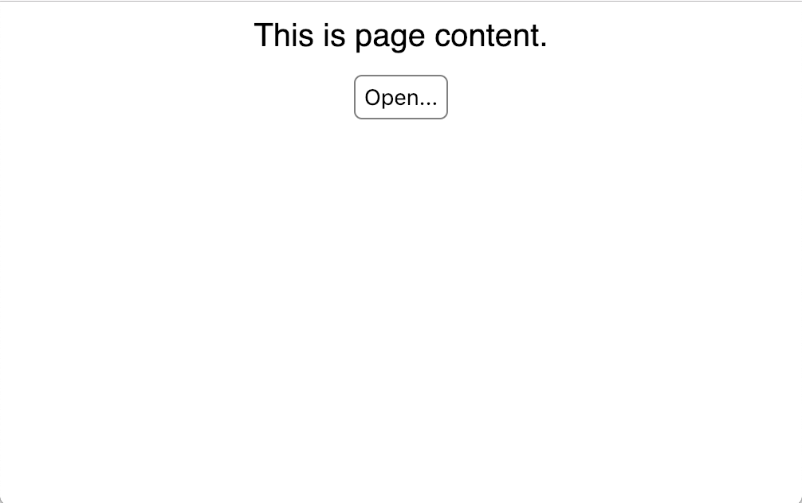
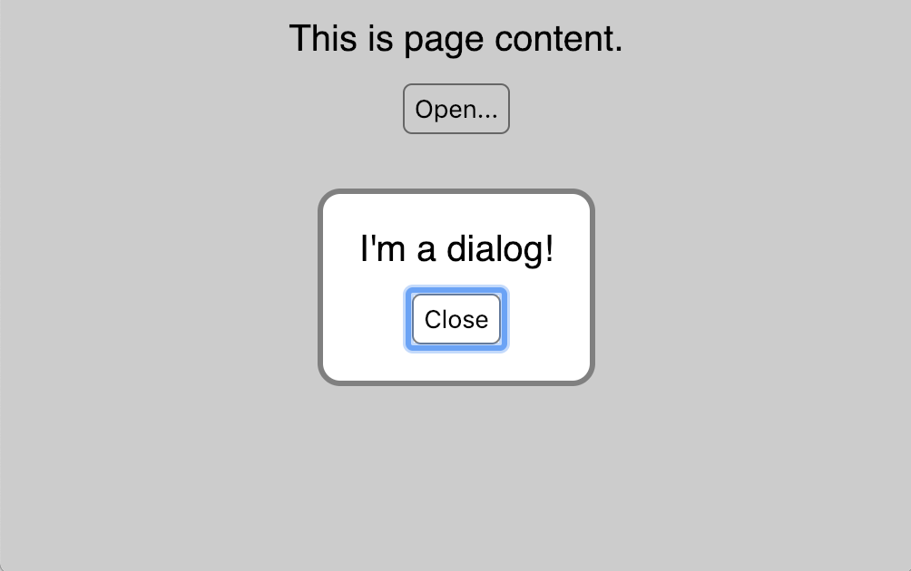

# HTML dialog Element

The `<dialog>` element was added to HTML in version 5.2.
It provides a way to define dialogs that can be styled with CSS.

## Past Alternatives

Before this addition, there were two primary options for
implementing dialogs in web applications.

First, the JavaScript functions `alert`, `confirm`, and `prompt`
can be used to display simple dialogs that cannot be styled.
These are not desirable because they cannot be made
to match the styles of web applications that use them.

Second, dialogs can be simulated with `<div>` tags
that have a higher CSS `z-index` than the page.
There are many libraries for many web frameworks
that take this approach. One example is
[react-modal](https://github.com/reactjs/react-modal).

These approaches are no longer needed
now that we can use the `<dialog>` element.

## Browser Support

As of January 25, 2019, the `<dialog>` element was
supported by Chrome, Firefox, and Opera,
but not by Edge, Internet Explorer, or Safari.
However, there is a polyfill named "dialog-polyfill"
that allows it to work in all of these browsers.
It is available at <https://github.com/GoogleChrome/dialog-polyfill>.

### Polyfill Install

If Node.js is not installed, browse <https://nodejs.org>,
download the "LTS" or "Current" version, and run the installer.

Install the polyfill by entering `npm install dialog-polyfill`.
Copy the files `dialog-polyfill.css` and `dialog-polyfill.js`
from the `node_modules/dialog-polyfill` directory
into the directory where `index.html` resides.
Typically it is in the `public` directory.

## Example Usage

Here is an example of using the `<dialog>` element in a React application.
It was created using
[`create-react-app`](https://facebook.github.io/create-react-app/).

No knowledge of React is required to understand the example.
It should be easy to extract the parts that are specific to the
dialog and use them with other frameworks or even with no framework.

Before the dialog is opened, the page has the following content:


After the dialog is opened, the page has the following content:


### `public/index.html`

Edit `index.html` and add the following lines
inside the `<head>` element.

```html
<script src="dialog-polyfill.js"></script>
<link rel="stylesheet" href="dialog-polyfill.css" />
```

### `src/App.js`

Here is the entire content of `App.js`
including comments the explain the relevant parts.

```js
// Tell ESLint that about global variables.
/* global dialogPolyfill: false */

import React, {Component} from 'react';
import './App.css';

class App extends Component {
  // This runs after the App component is rendered.
  componentDidMount() {
    // Find the dialog using a CSS selector
    // and save it for later.
    this.dialog = document.querySelector('dialog');

    // Register the dialog with the polyfill which is
    // required by browsers that lack native support.
    dialogPolyfill.registerDialog(this.dialog);
  }

  openDialog = () => {
    // This is what actually causes the dialog to open.
    // By default it will be centered on the page.
    this.dialog.showModal();
  };

  render() {
    return (
      <div className="App">
        <!-- This defines the content of the dialog which
             can be any HTML, including form elements. -->
        <dialog>
          I'm a dialog!
          <!-- This renders a "Close" button that will
               close the dialog when it is clicked. -->
          <form method="dialog">
            <input type="submit" value="Close" />
          </form>
        </dialog>

        <div>This is the page content.</div>

        <!-- Pressing this button causes the dialog to open. -->
        <button onClick={this.openDialog}>Open...</button>
      </div>
    );
  }
}

export default App;
```

### `src/App.css`

Here is the CSS that styles the dialog
and the buttons that open and close it.

```css
/* These are styles for buttons, including
   submit buttons used to close dialogs.
   The background-color and box-shadow styles
   must be specified in order to make the buttons
   look the same across various browser. */
button,
input[type='submit'] {
  background-color: white;
  border: solid gray 1px;
  border-radius: 4px;
  box-shadow: none;
  margin-top: 10px;
  padding: 4px;
}

/* These are the styles for the dialog */
dialog {
  border: solid gray 2px;
  border-radius: 10px;
}

/* This is the style for outside the dialog
   when the dialog is displayed
   to make it clear that it is a "modal dialog" and
   the user cannot interact with anything outside it. */
::backdrop /* for native dialogs */,
dialog + .backdrop /* for the dialog-polyfill */ {
  /* a transparent shade of gray */
  background-color: rgba(0, 0, 0, 0.2);
}
```

## Summary

Even with the need to use a polyfill,
the `<dialog>` element is pretty easy to use!
